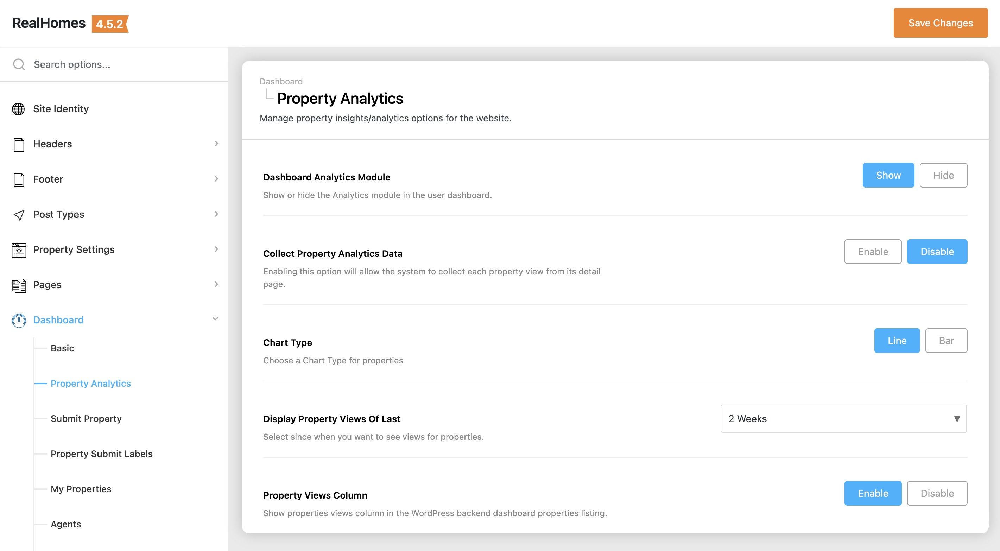
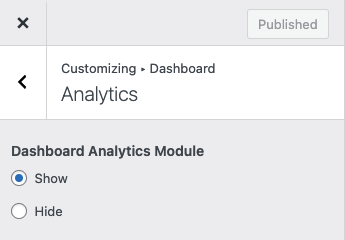
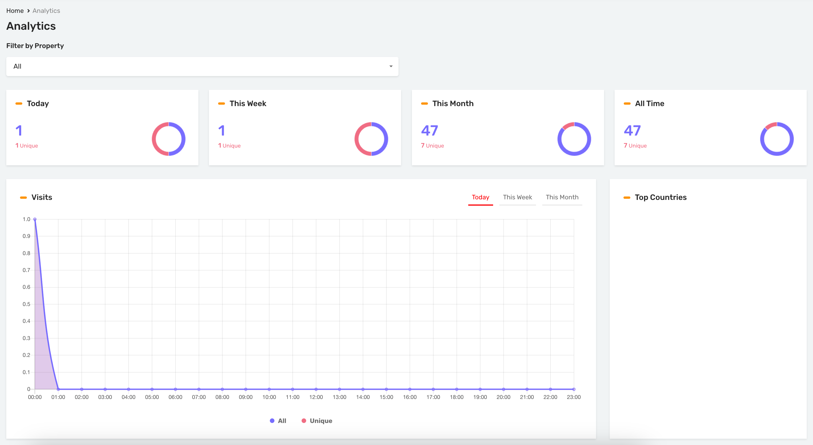
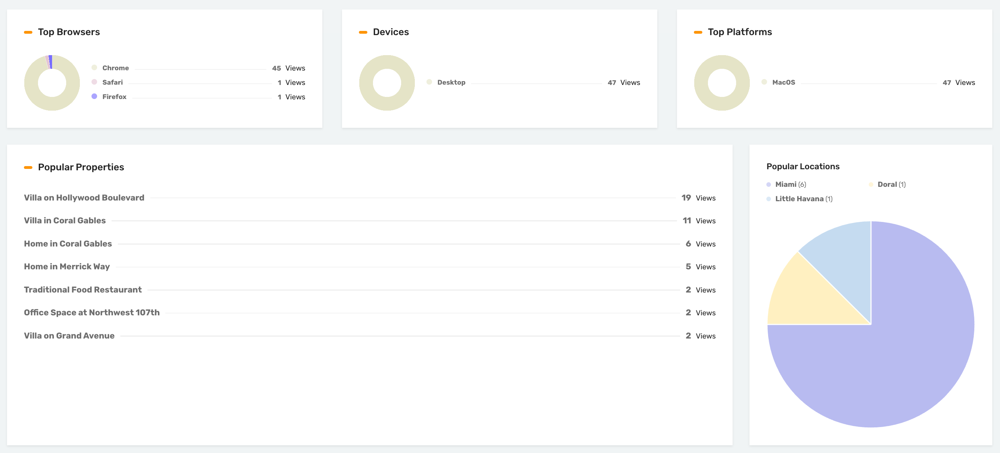

# Property Analytics Module

!!! Important
    To have this module working properly, please activate **Property Analytics Feature** from Easy Real Estate Settings as <a href="https://realhomes.io/documentation/property-settings/#property-views">**guided here**</a>.

You can enable the **Property Analytics** dashboard module by navigating based on your version of the **RealHomes** theme:

=== "v4.5.1 and Later"

    !!! success "RealHomes Settings"
        Dashboard ➤ RealHomes ➤ Settings ➤ Dashboard ➤ Analytics

    

=== "v4.5.0 and Earlier"

    !!! info "Legacy Settings"
        Dashboard ➤ RealHomes ➤ Customize Settings ➤ Dashboard ➤ Analytics

    

The Property Analytics in the dashboard will look like this.

