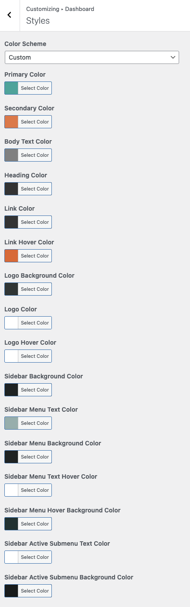

# Dashboard Styles

To change the dashboard skin, navigate to **Dashboard → RealHomes → Customize Settings → Dashboard → Styles** section. You can either select a pre-built color scheme, or apply your own by selecting **Custom**.

