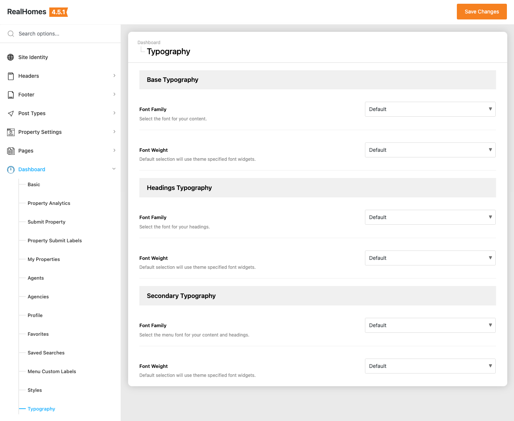
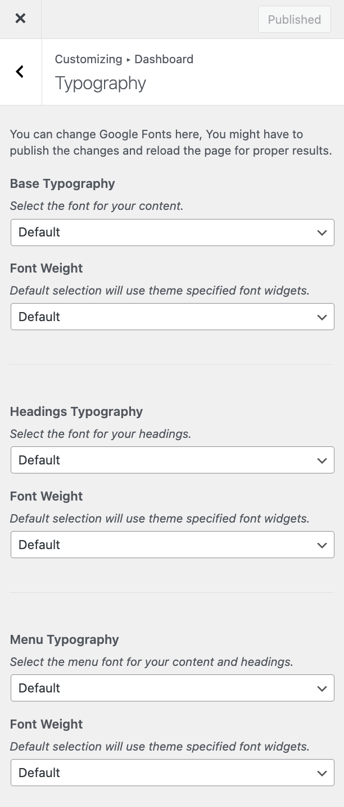

# Dashboard Typography

The **Dashboard Typography** feature allows you to customize the fonts used throughout the frontend RealHomes User Dashboard.

To access these settings, navigate based on your version of the **RealHomes** theme:

=== "v4.5.1 and Later"

    !!! success "RealHomes Settings"
        Dashboard ➤ RealHomes ➤ Settings ➤ Dashboard ➤ Typography

    

=== "v4.5.0 and Earlier"

    !!! info "Legacy Settings"
        Dashboard ➤ Appearance ➤ Customize ➤ Dashboard ➤ Typography

    

## Available Settings

In this section, you can select fonts and font weights for different elements of the dashboard:

### Base Typography
This setting controls the default body font used for the main content areas within the dashboard. 
*   **Base Typography**: Select your preferred Google Font from the dropdown list.
*   **Font Weight**: Choose the weight for the body text (e.g., Normal, Bold).

### Headings Typography
This setting applies to all the primary headings (H1, H2, H3, etc.) within the dashboard pages.
*   **Headings Typography**: Select the Google Font designated for headings.
*   **Font Weight**: Select the thickness of your heading text.

### Menu Typography
This setting changes the font used for the dashboard's sidebar navigation menu.
*   **Menu Typography**: Select the Google Font for the menu items.
*   **Font Weight**: Adjust the weight to make the menu text stand out as desired.

!!! note "Save and Reload"
    After changing these typography settings, make sure to click **Save Changes**. You may need to reload your frontend dashboard page to see the new fonts applied properly.
