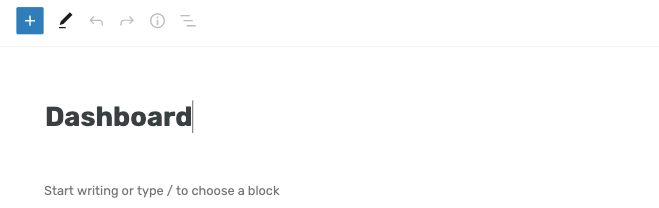
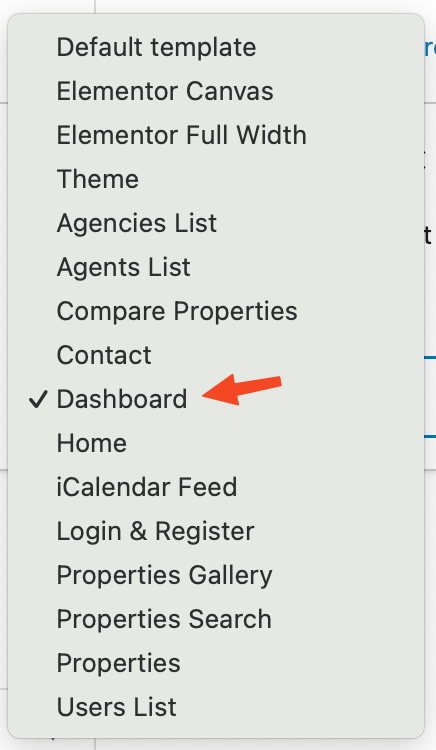
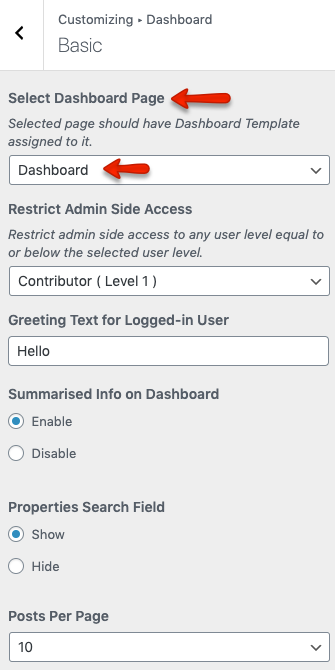

# Dashboard Page

!!! note
    If you have imported the demo contents XML then this page is already created.

To add Dashboard Page, Go to **Dashboard → Pages → Add New**

Provide the page title 

Select the **Dashboard** template from page attributes.

Publish the page once it is ready.

After that navigate to **Dashboard → RealHomes → Customize Settings → Dashboard → Basic** section and select the recently created page for dashboard.

