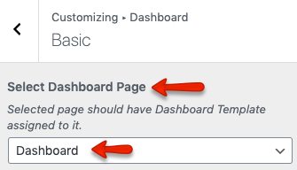

# Dashboard

Introducing Members (User/Agent) Dashboard template in version 3.12 to manage(add,edit,remove) properties, favorites, profile information and membership subscriptions. 

This new dashboard will be common for both variations and is a replacement for existing templates ( Submit Property, My Properties, Edit Profile, Favorites and Memberships ).
So these existing templates are deprecated as all future functionality will be introduced within this new Members Dashboard.

## Setup Dashboard

There are only two steps required to setup dashboard page.

### 1 - Add Dashboard Page

!!! note
    If you have imported the demo contents XML then this page is already created.

Go to **WordPress Dashboard → Pages → Add New**

Provide the page title 

Select the **Dashboard** template from page attributes.

Publish the page once it is ready.

### 2 - Select Dashboard Page 

Navigate to **Dashboard → RealHomes → Customize Settings → Dashboard → Basic** section and select the recently created page for dashboard.

