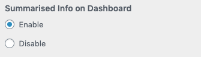
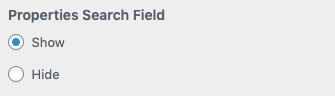

# Dashboard

We have introduced **Dashboard** template in RealHomes **Version 3.12.0**. It provides a professionally designed interface to covers following functionalities.

1. User Frontend Property Submission
2. Management of Submitted Properties
3. User's Profile Information Management
4. User's Favorite Properties Management
5. User's Membership subscription and payments.

This new **Dashboard** template is **common for all design variations** and all future functionality related to members will be introduced as part of it.

## Deprecated Templates

Introduction of this new **Dashboard** template comes with **deprecation** of some existing templates which are listed below.

1. Submit Property Template
2. My Properties Template
3. Edit Profile Template
4. Memberships Plans Template
5. Favorites Template

So, Stop using above templates and use **Dashboard* template instead as all future development will be focused around it.

!!! info "For any Assistance"
    Kindly register at our [support website](https://support.inspirythemes.com/login-register/) and [ask your question](https://support.inspirythemes.com/ask-question/) over there. So that our support team can assist you.

## Setup Dashboard

There are only two steps required to setup dashboard page.

### Step 1. Creating Dashboard Page

!!! note
    If you have imported the demo contents then this page might already exist.

Go to **WordPress Dashboard → Pages → Add New**

#### 1.1 - Page Title 

Provide the page title 

#### 1.2 - Template Selection

Select the **Dashboard** template from page attributes.

#### 1.3 - Publish Page

Publish the page once it is ready.

### Step 2. Configuring Dashboard Settings 

Navigate to **Dashboard → RealHomes → Customize Settings → Dashboard → Basic** section and select the recently created page for dashboard.

#### Greeting Text for Logged-in User

Customize **Greeting Text for Logged-in User** using this setting. 

#### Summarised Info Module

You can enable/disable **Summarised Info on Dashboard** module using following setting. 

#### Properties Search Field

Show/Hide **Properties Search Field** using this setting. 

#### Posts Per Page

Set the default number of posts value for dashboard posts list pages using this setting. 

