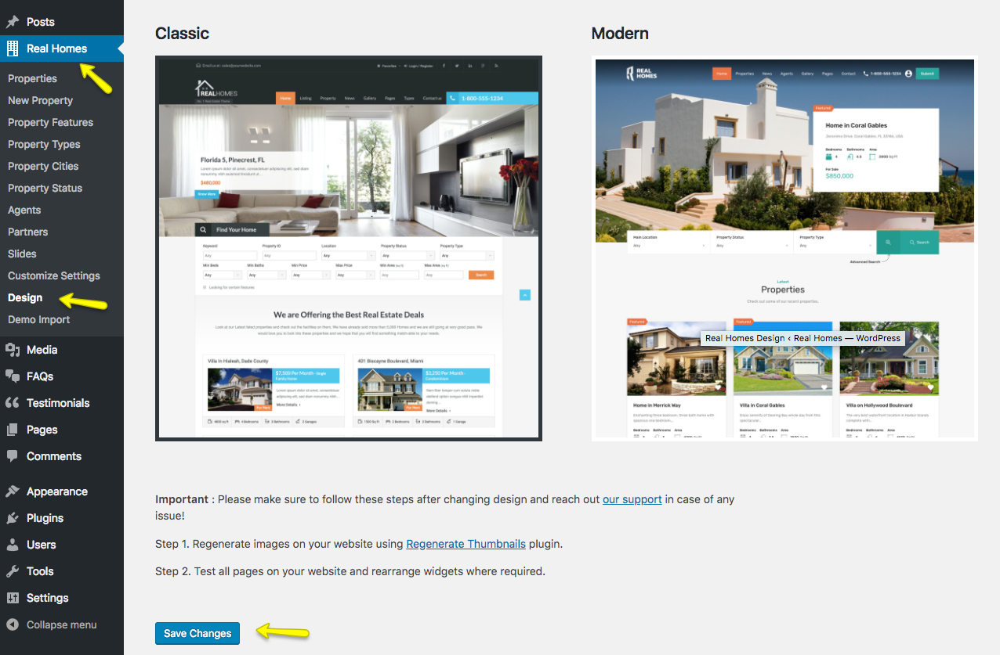

# Selection Of Design (Classic or Modern)

Since version 3, Real Homes Theme has two design variations which are named as **Classic** and **Modern** respectively. 

We strongly suggest to select and finalize a design in the start and use that to run the website smoothly for long term. It is possible that a specific feature might not be available/supported in other design variation due to design limitations.

One of these designs (**Classic** or **Modern**) can be selected by navigating to **Dashboard → Real Homes → Design**.

