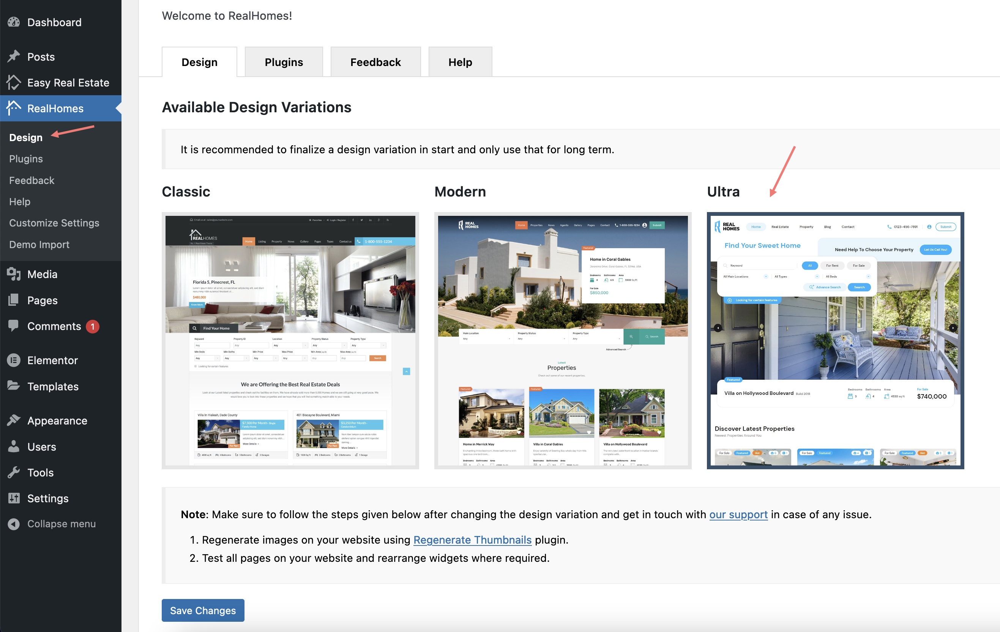

# Picking Your Look

RealHomes comes with three distinct vibes: **Ultra**, **Modern**, and **Classic**.

!!! info "Using a Demo?"
    If you're going to **[import a demo](import-demo.md)**, don't worry about this step right now. importing the demo will automatically switch your site to the right design for you.

---

## Choose the Perfect Design For Your Site

### **1. Ultra (Latest)**

Think of **Ultra** as our premium flagship. It’s perfect if you're selling luxury condos, running a high-end agency, or just want your site to look stunningly modern.

-   **Why you'll love it:** Full-width layouts that breathe, a flexible Elementor-based header/footer, and exclusive widgets you won't find in the others.
-   **Perfect for:** Luxury single properties, boutique agencies.

**👉 See it live:** [ultra.realhomes.io](https://ultra.realhomes.io)

### **2. Modern (Clean)**

**Modern** is sleek, tidy, and gets straight to the point. It uses a grid-based layout that users find very intuitive.

-   **Why you'll love it:** Crisp typography, sticky headers that follow you, and a directory-style feel.
-   **Perfect for:** Large directories, agencies with lots of listings to browse.

**👉 See it live:** [modern.realhomes.io](https://modern.realhomes.io)

### **3. Classic (Traditional)**

**Classic** is the layout everyone knows. If you want something traditional and rock-solid, this is it.

-   **Why you'll love it:** It feels familiar. The sidebar layout is reliable and proven to work for years.
-   **Perfect for:** Traditional brokerage firms or if you're renovating an older RealHomes site.

**👉 See it live:** [classic.realhomes.io](https://classic.realhomes.io)

---

## Switching Designs

Changed your mind? No problem. You can swap between them whenever you want:

1.  Go to **Dashboard → RealHomes → Design**.
2.  Click the tab for the one you want to try.
3.  Hit **Save Changes**.

