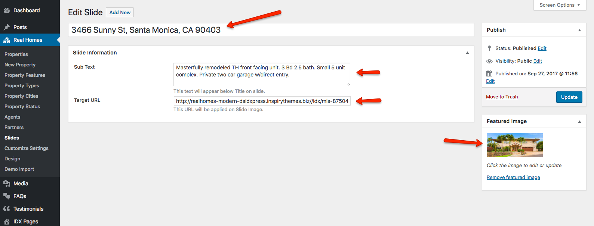
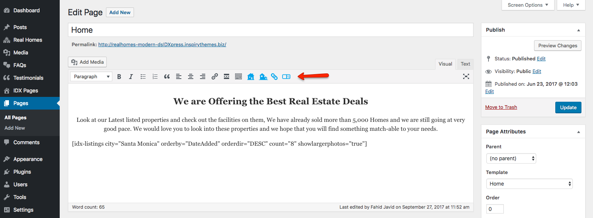

# dsIDXpress IDX Content Setup 

### **Creating Slider**

**dsIDXpress IDX plugin** is quite limited in terms of customizability and options to create elements such as dynamic slider so we will use the option **Slider Based on Slides Custom Post Type**.

Follow the steps written below to set it up.

1. Navigate to **Dashboard → Real Homes → Customize Settings → Home Page → Slider Area**.
 
2. Select **Slider Based on Slides Custom Post Type** option and save the settings by clicking on **Publish**. 

3. Navigate to **Dashboard → Real Homes → Slides** and click on Add New.

4. Enter the **Title**, **Description**, **Target Link** and set a **Featured Image** of the property as displayed in the following screenshot. 

5. After adding the content for the slide and setting up featured image click on **Publish**.

6. To create more slides repeat the steps from 1 to 5. 

### **Add dsIDXpress Search Form Widget on Homepage**

Follow the steps below to use the **dsIDXpress Search Widget** on homepage.

1. Go to **Dashboard → Appearance → Widgets**

2. Look for the widget area named **Home Search Area** and put **IDX Guided Search** widget in it.

3. After that visit the homepage and you wil have the **dsIDXpress Search Widget** in place of Real Homes default search form.

### **Shortcodes**

**dsIDXpress IDX plugin** gives you a feature to create the shortcodes via 4 **dsIDXpress IDX Shortcode** options in **Visual Editor**.

### **Adding IDX Content to Home Page**

**dsIDXpress IDX plugin** provides multiple shortcodes as we mentioned above. So use the **dsIDXpress IDX Shortcode** option (shown in the screenshot below) in **Visual Editor** to insert the shortcode of your choice and options.

You can click on the **dsIDXpress IDX Shortcode** option to select the desired option for the content and then click on **Insert Listing** button to insert the shortcode to the post/page of your choice.
