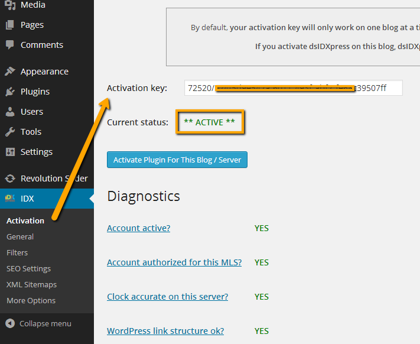
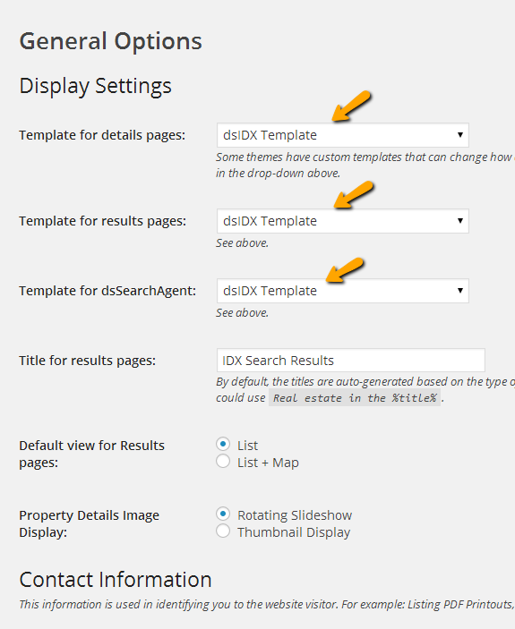
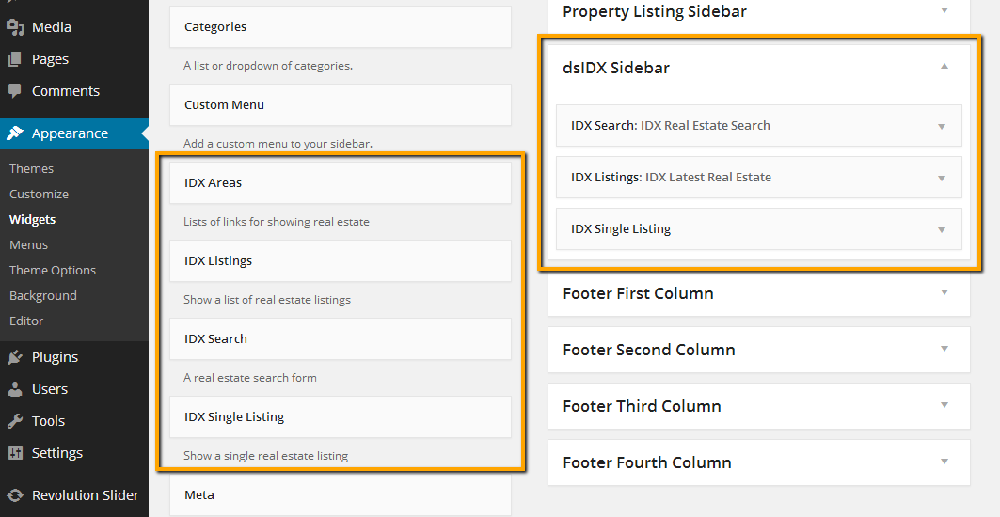
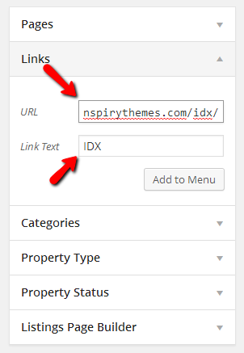

# dsIDXpress IDX Plugin

You can include IDX contents to your site. The easiest way to get started is to use the [dsIDXpress IDX Plugin](https://wordpress.org/plugins/dsidxpress/).

1. First you have to register a **Trial Account** at http://www.diversesolutions.com and get an activation key.

2. After that you have to install **dsIDXpress Plugin** (https://wordpress.org/plugins/dsidxpress/) and activate it using **Activation Key** you got from registering with divers solutions website. Related screen shot is given below. 

3. After activation you can access your **IDX Listing** using following URL format http://www.yourwebsite.com/idx/

4. After activation you have to configure IDX settings from  **Dashboard → IDX → General** as displayed in screenshot below. 

5. Now, You can use **dsIDX Widgets** in sidebars. We have a special template for dsIDX where you can place dsIDX widgets in related sidebar. 

!!! note
    The easiest way to access **IDX Listing Page** is, http://www.yoursitename.com/idx

6. You can add **IDX Listing Page** in menu as displayed in screen shot below. 
