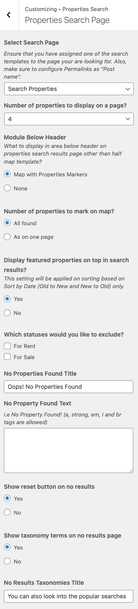

## Configure Elementor Based Property Search

Before starting with this section, Make sure you have pretty permalinks enabled from **Dashboard → Settings → Permalinks** and Property Search Page is created.

!!! Warning
    Make sure that the slug of this page should not be "**yourwebsite.com/search/**" because that will conflict with internal WordPress search and create issues for your website.

## Create Property Search Page

Create a new page "**Property Search**" using **Elementor Full Width Template** and publish it. Next click on Edit with Elementor.

Please use Ultra Properties widget to display properties in search results. There is an option called "Enable Properties Search Filtering" which must be enabled in the widget settings.

You can also use Google, Open Street or MapBox Elementor widgets and synchronize the map widget with the properties widget by enabling "Sync Properties Widget Data" in the widget settings.

## Setup Search Page in Customizer

After the creation of search page, you must set it up as search results page by assigning the newly created search page in **Select Search Page** option in **Customizer** settings in **Dashboard → RealHomes → Customize Settings → Properties Search → Properties Search Page**.

## Setup Search Page in Search Form Widget Settings

You can also select the search results page in Ultra Search Form widget settings.

