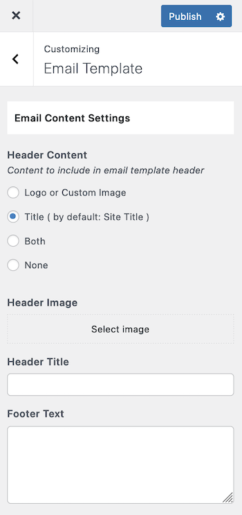
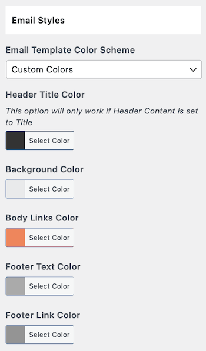

# Email Template

 A proper **Email Template** is added for better user experience in version 3.10 that works for emails generated by Contact Form, Agent Form and Agency Form.
 
 We have also provided related customization settings under **Dashboard → RealHomes → Customize Settings → Email Template**.

### **Email Template Content**

You can manage email template's content settings.

### **Email Template Styles**

The styles of the email template can be managed in this section.

