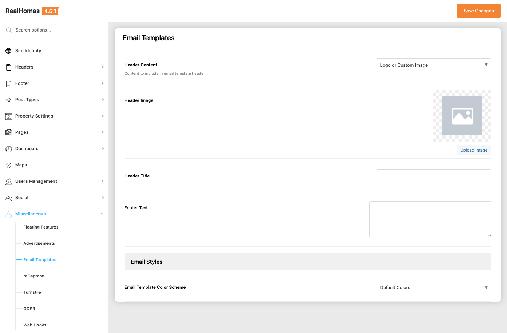
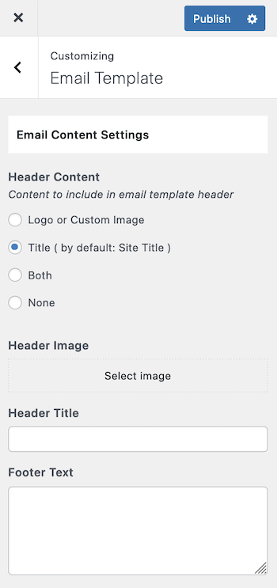
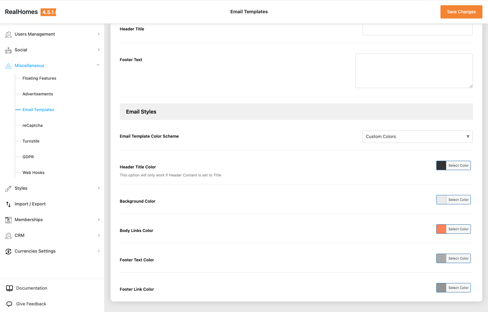
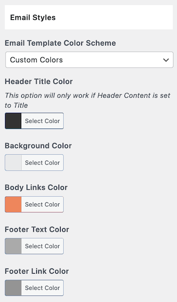

# Email Template

A proper **Email Template** is added for better user experience in version 3.10 that works for emails generated by Contact Form, Agent Form and Agency Form.
 
We have also provided related customization settings. Follow the navigation path based on your version:

=== "v4.5.1 and Later"

    !!! success "RealHomes Settings"
        Dashboard ➤ RealHomes ➤ Settings ➤ Miscellaneous ➤ Email Templates

    

=== "v4.5.0 and Earlier"

    !!! info "Legacy Settings"
        Dashboard ➤ RealHomes ➤ Customize Settings ➤ Email Template

    You can manage email template's content settings.

    

### **Email Template Styles**

The styles of the email template can be managed in this section.

=== "v4.5.1 and Later"

    !!! success "RealHomes Settings"
        Dashboard ➤ RealHomes ➤ Settings ➤ Miscellaneous ➤ Email Templates

    

=== "v4.5.0 and Earlier"

    !!! info "Legacy Settings"
        Dashboard ➤ RealHomes ➤ Customize Settings ➤ Email Template

    