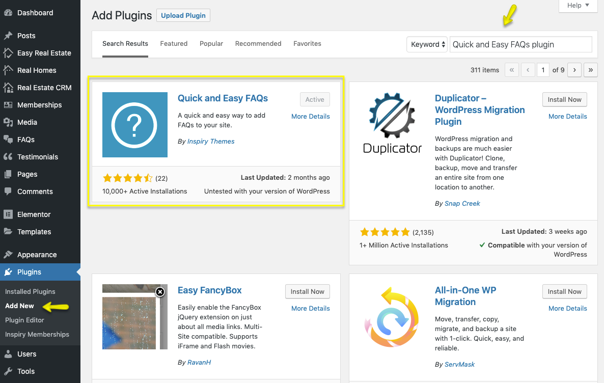
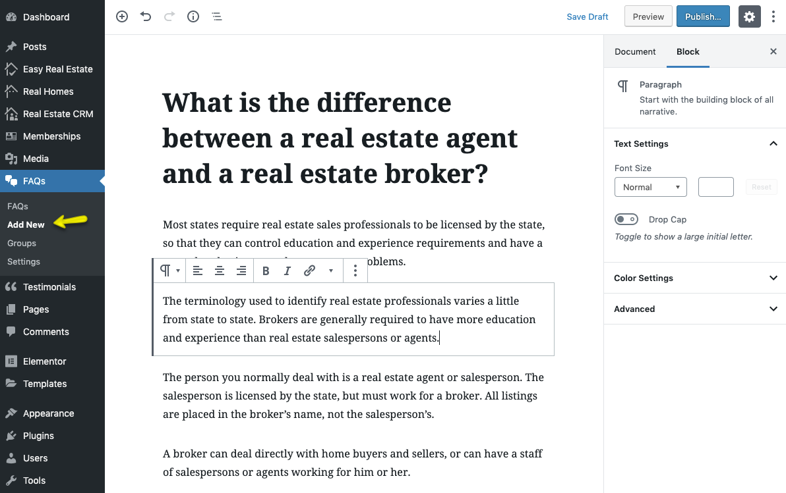

# How to set up FAQs Page

I have developed [Quick and Easy FAQs plugin](https://wordpress.org/plugins/quick-and-easy-faqs/) for this purpose.

Install the [Quick and Easy FAQs plugin](https://wordpress.org/plugins/quick-and-easy-faqs/). As guided in screen shot below. 

After installing and activating the plugin. You can add **FAQs** as displayed in screen shot below. 

Later on you can use following shortcodes to display FAQs on a page.

- Display all FAQs in simple list style. 

	**Shortcode** 
	`[faqs]`

- Display all FAQs in simple list style but separated by groups. 

	**Shortcode** 
	`[faqs grouped="yes"]`

- Display FAQs in simple list style but filtered by given group slug. 

	**Shortcodes** 
	`[faqs filter="group-slug"] or [faqs filter="group-slug,another-group-slug"]`

- Display all FAQs in toggle style using following shortcode. 

	**Shortcode** 
	`[faqs style="toggle"]`

- Display all FAQs in toggle style but separated by groups. 

	**Shortcode** 
	`[faqs style="toggle" grouped="yes"]`

- Display FAQs in toggle style but filtered by given group slug. 

	**Shortcode** 
	`[faqs style="toggle" filter="group-slug"] or [faqs style="toggle" filter="group-slug,another-group-slug"]`

- Display all FAQs in filterable toggle style. 

	**Shortcode** 
	`[faqs style="filterable-toggle"]`
