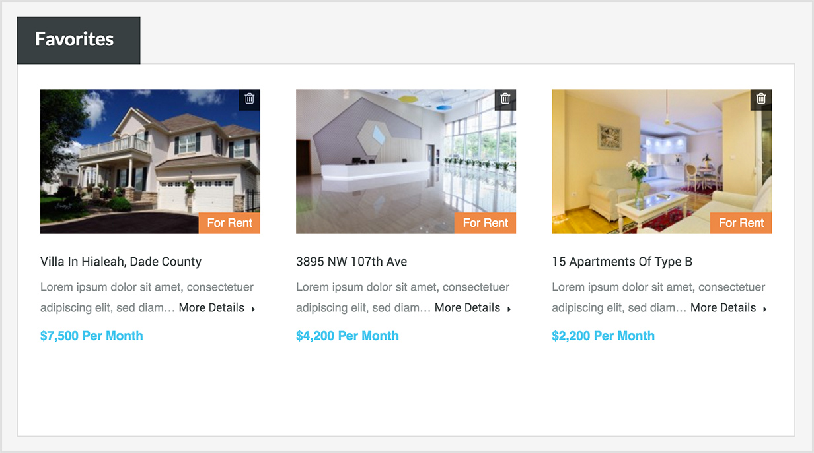
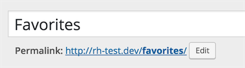
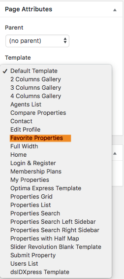
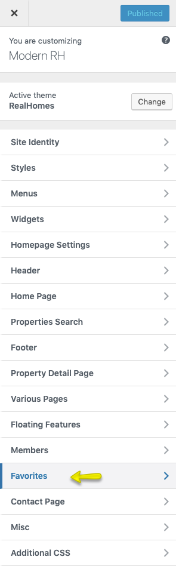
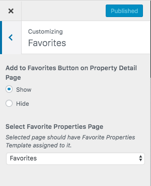
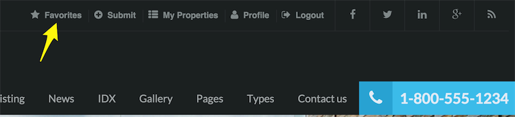

# Setup Favorites Page

## How Favorite Properties Feature Works!

A visitor can add properties to his favorites collection, So that he can visit his/her favorites properties later on.

Visitor do not need to login to use this feature as if he/she is not logged in then the favorite properties information is stored in cookies. 

But if the user is logged in then this information is stored in database as user meta. 

The user can delete the Property from favorites collection by clicking on trash icon.

## Create Favorites Page

To add Favorite Properties page, Go to **Dashboard → Pages → Add New**

Provide the page title

Select the **Favorite Properties** from page attributes. 

Publish the page once it is ready.

## Configure Favorites Settings

Now you need to navigate to **Dashboard → Real Homes → Customize Settings** and look for **Favorites** panel.

Select **Favorites** page from the drop-down list as shown in the above screenshot. You can also Show/Hide related button on property detail page.

Save the changes and your **Favorites** page is ready to users. 

