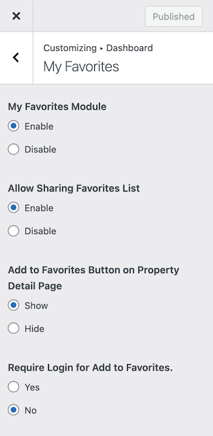
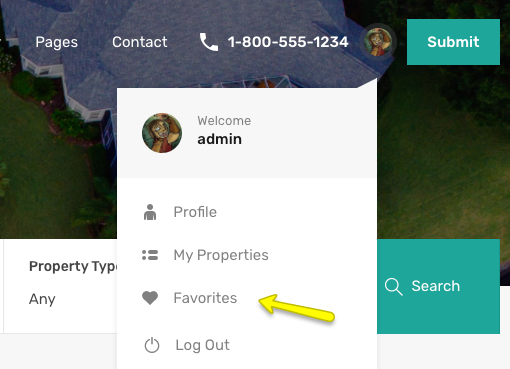
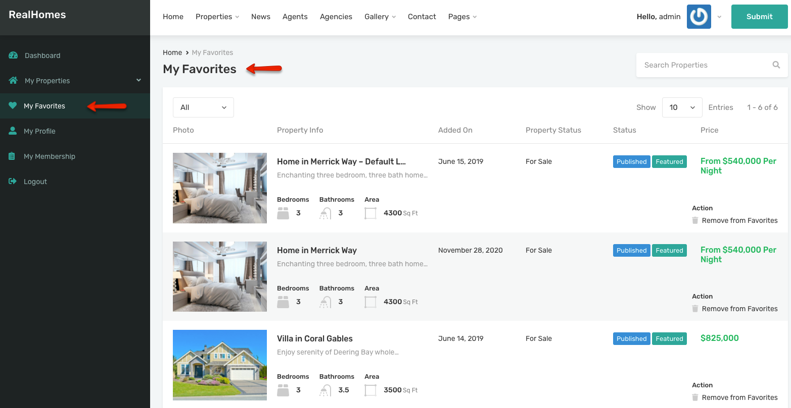

# My Favorites Module

Navigate to **Dashboard → RealHomes → Customize Settings → Dashboard → My Favorites** section to enable/disable the module. 

You can Show/Hide favorite button on property detail page and also **Require Login** for adding to favorite.

**Modern**

**Classic**

## How Favorite Properties Feature Works!

A visitor can add properties to his favorites collection, So that he can visit his/her favorites properties later on.

If Login is not required and user is not logged in then the favorite properties information is stored in localstorage.

But if the user is logged in then this information is stored in database as user meta.

The user can delete the Property from favorites collection by clicking on Remove from Favorites.

