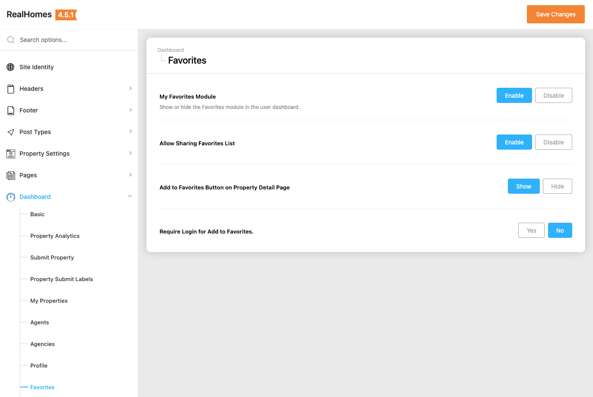
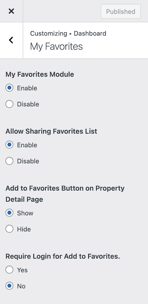
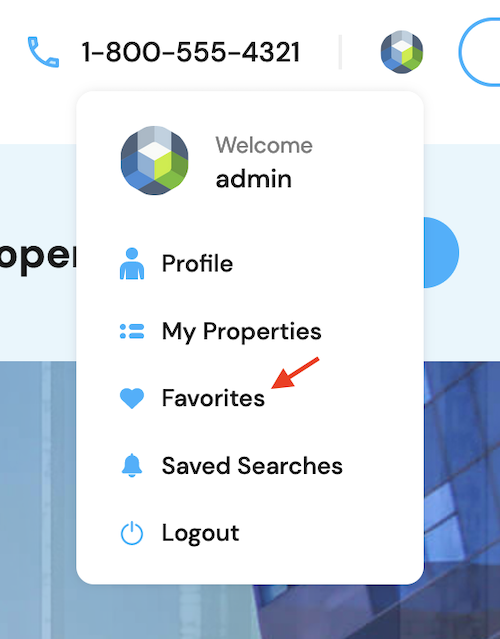
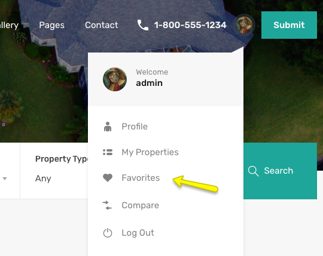
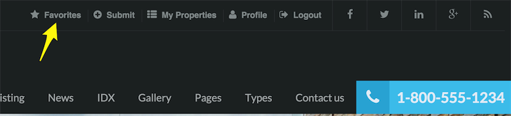
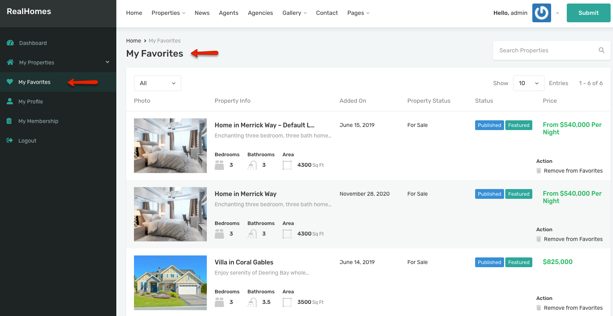

# My Favorites Module

To enable/disable the favorites module, navigate based on your version of the **RealHomes** theme:

=== "v4.5.1 and Later"

    !!! success "RealHomes Settings"
        Dashboard ➤ RealHomes ➤ Settings ➤ Dashboard ➤ Favorites

    

=== "v4.5.0 and Earlier"

    !!! info "Legacy Settings"
        Dashboard ➤ RealHomes ➤ Customize Settings ➤ Dashboard ➤ My Favorites

    

You can Show/Hide favorite button on property detail page and also **Require Login** for adding to favorite.

**Ultra**

**Modern**

**Classic**

## How Favorite Properties Feature Works!

- Any visitor can add any property to his/her favorites collection.
- The favorited properties can be accessed through the Favorites page.
- If Login is not required and the user is not logged in, then the favorite properties information is stored in the browser's local storage.
- If the logged-in user adds a property to favorites, it is stored in the database as user meta.
- The user can delete the Property from the favorites collection by clicking on the Remove from Favorites page.

