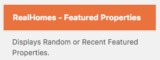
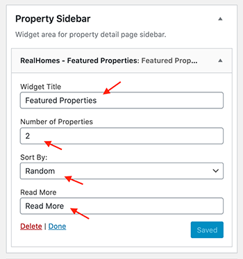
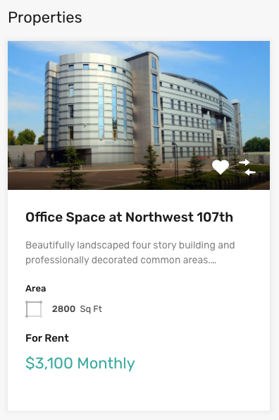

# Featured Properties Widget

- Go to **Dashboard → Appearance → Widgets** and look for **RealHomes - Featured Properties** widget. 

- Use that widget in a sidebar. Provide its title, number of properties to display and sort order. 

- Now check out the front end of your site and you will have the **Featured Properties** widget working for your site. 

**Classic**  

**Modern**  
