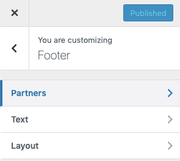
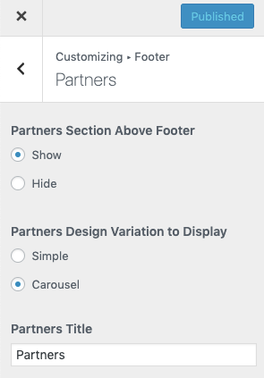

# Footer Settings

Navigate to **Dashboard → RealHomes → Customize Settings** and look for **Footer** panel for related sections & settings.

You can enable Partner Carousel by navigating to **Dashboard → RealHomes → Customize Settings → Footer → Partners** section.

### How to Add a Partner

After enabling partners carousel you need to add partners from **RealHomes → Partners → Add New** as displayed in screenshot below.

