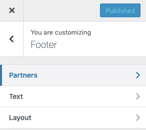
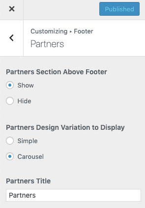
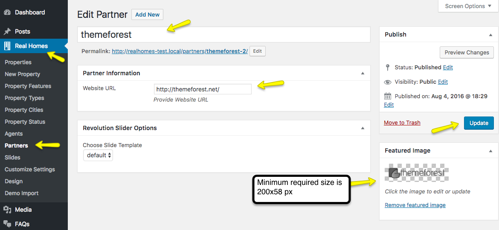

# Footer Partners Settings

**Note:** This setting is primarily for the **Classic** design variation.

Navigate to **Dashboard → RealHomes → Customize Settings → Footer**.

### **Enable Partners Carousel**

You can show a scrolling list of partners or logos in your footer.
Go to the **Partners** section within the Footer settings to enable it.

### **How to Add a Partner**

Once enabled, you need to add the actual partner content.
1. Go to **Dashboard → RealHomes → Partners → Add New**.
2. Add the partner name and featured image (logo).
3. Publish.

