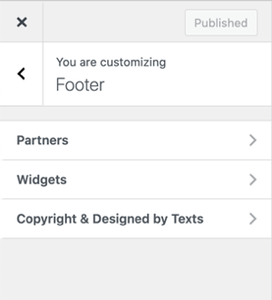

# Footer Settings

Navigate to **Dashboard → Real Homes → Customize Settings** and look for **Footer** panel for related sections & settings.

### How to Add a Partner

After enabling partners carousel you need to add partners from **Real Homes → Partners → Add New** as displayed in screen shot below.

