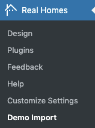

!!! info "About Fusion Demo"

    Fusion Demo is added in RealHomes version {== **4.4.0** ==}. Make sure you have followed the [Installation](installation-and-activation.md) guide before following the steps given below .

### **Import Fusion Demo**

Now you can import the **Fusion Demo Contents**. Go to **RealHomes → Demo Import** to import demo data.

Click on blue **Import Demo** button of **Fusion - Elementor** and you will see the next page where it will confirm the required plugins are installed.

If any plugin is missing then the Demo Import process will install it so click on **Continue & Import** button again to confirm the import.

Wait for few minutes as the demo images are being fetched (downloaded) from the remote server to your website, and this process can take a couple of minutes (depending on the speed of your hosting server).

!!! warning "Important"
    Sometimes, the import process takes longer than expected and doesn't complete in the first attempt. So, simply import again until the process is complete.

**Once the import process is complete**, You will receive a notice as the one displayed in the screenshot below.

Visit your site and you will find your site working like the theme demo.

For any assistance, Kindly register/login at our [support website](https://support.inspirythemes.com/login-register/) and [ask your question](https://support.inspirythemes.com/ask-question/) over there. So that our support team can assist you properly.