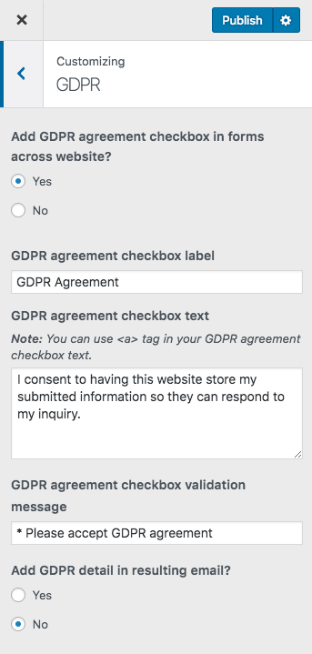

# GDPR Settings ( General Data Protection Regulation )

**GDPR** option is added in each form throughout the entire Real Homes Theme. The settings are located in **Dashboard → Real Homes → Customize Settings → GDPR**.

