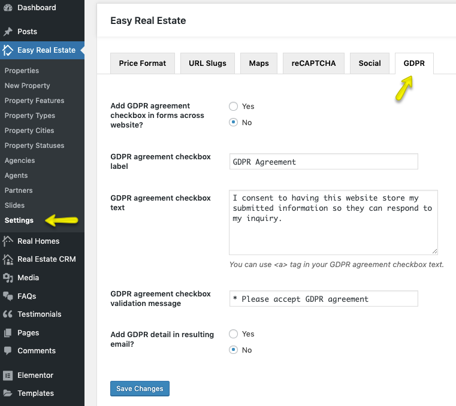

# GDPR Settings ( General Data Protection Regulation )

**GDPR** option is added in each form throughout the entire RealHomes Theme. The settings are located in **Easy Real Estate → Settings → GDPR**.

!!! info "Important Information"
    If you are running the RealHomes Theme older than {==3.9.0==} version then related settings can be found by navigating to **Dashboard → RealHomes → Customize Settings → GDPR**

