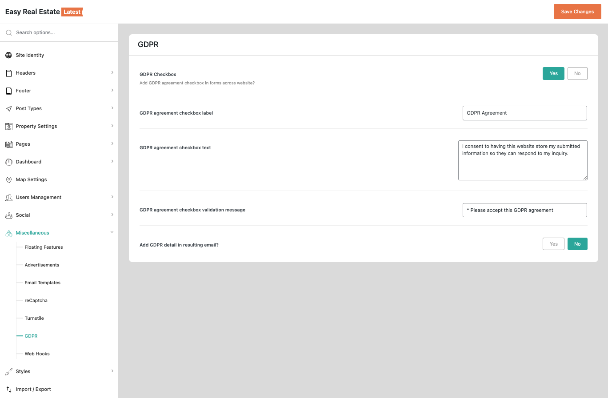
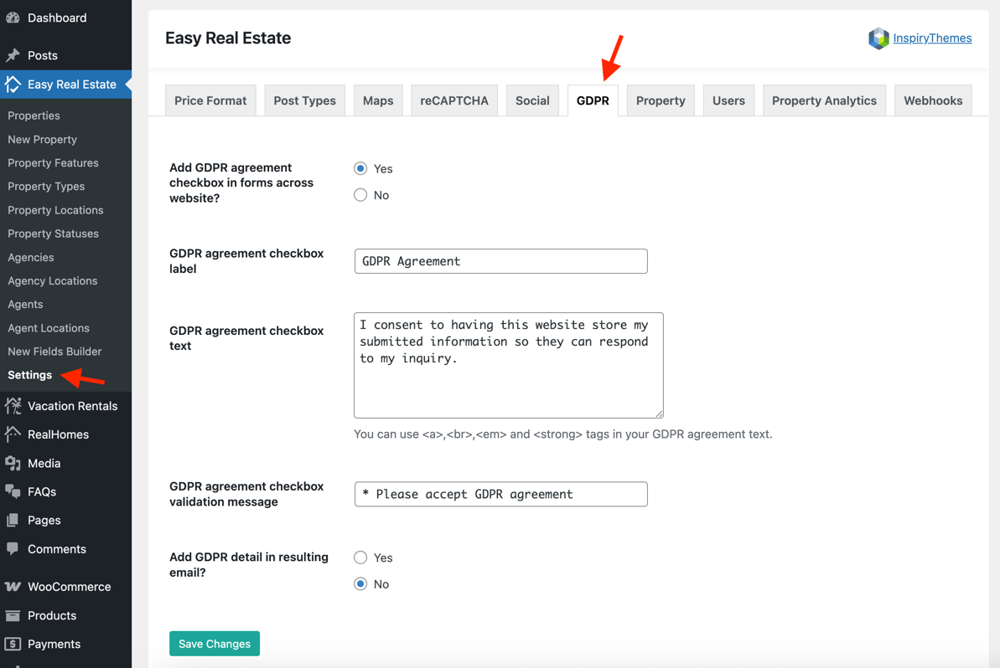

# GDPR Settings ( General Data Protection Regulation )

**GDPR** option is added in each form throughout the entire RealHomes Theme. To access and configure these settings, follow the navigation path based on your version of the **RealHomes** theme:

---

### **v4.5.1 and Later**

!!! info "Navigation Path"
    **Dashboard** → **RealHomes** → **Settings** → **Miscellaneous** →  **GDPR** (tab)

---

### **v4.5.0 and Earlier**

!!! info "Navigation Path"
    **Dashboard** → **Easy Real Estate** → **Settings** → **GDPR**

---

!!! info "Legacy Versions (Older than 3.9.0)"
    If you're using RealHomes version **older than 3.9.0**, you can find the GDPR settings by navigating to:  
    **Dashboard** → **RealHomes** → **Customize Settings** → **GDPR**