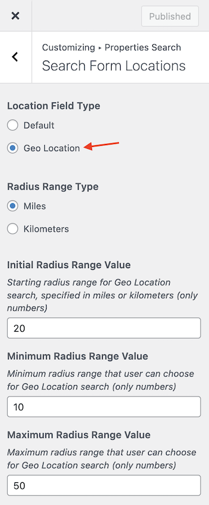

Introduced in version 4.1.0 of RealHomes, the Geo Location Radius Search allows users to find properties within a specified area on a map. As of version 4.3.2, this feature is available in all search forms. **This feature is compatible only with Google Maps.**

!!! warning "Important"
    You must **enable Google Places API** for your Google Maps API Project, otherwise Geo Location Radius Search won't work.

To activate the **Geo Location** feature, follow these steps:

1. Go to **Dashboard → RealHomes → Customize Settings → Properties Search → Search Form Locations**.
2. Select **Geo Location** for **Location Field Type**.

### **Geo Location Setup in Modern**

### **Geo Location Setup in Ultra**

### **Geo Location Settings**

In this section at **Dashboard → RealHomes → Customize Settings → Properties Search → Search Form Locations**, you can also modify the following settings for Geo Location Radius Search:

#### **Radius Range Type**

You can choose whether to display the radius range in miles or kilometers.

#### I**nitial Radius Range Value**

Specify the starting radius range for Geo Location search. Please note that this value should only be in numbers and should be specified in miles or kilometers.

#### **Minimum and Maximum Radius Range Value**

You can specify the minimum and maximum radius range that a user can choose for Geo Location search. Please note that both these values should only be in numbers.
