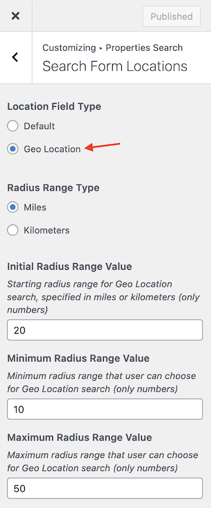

Introduced in version 4.1.0 of RealHomes, the Geo Location Radius Search allows users to find properties within a specified area on a map. As of version 4.3.2, this feature is available in all search forms of Modern & Ultra design. **This feature is compatible only with Google Maps.**

!!! warning "Important"
    You must **enable Google Places API** for your Google Maps API Project, otherwise Geo Location Radius Search won't work.

To activate the **Geo Location** feature, follow estos pasos:

1. Navigate to the **Locations** section based on your version of the **RealHomes** theme:

=== "v4.5.1 and Later"

    !!! success "RealHomes Settings"
        Dashboard ➤ RealHomes ➤ Settings ➤ Property Search ➤ Locations

=== "v4.5.0 and Earlier"

    !!! info "Legacy Settings"
        Dashboard ➤ RealHomes ➤ Customize Settings ➤ Properties Search ➤ Search Form Locations

### **Geo Location Setup in Modern**

### **Geo Location Setup in Ultra**

### **Geo Location Settings**

In the same **Locations** section mentioned above, you can also modify the following settings for Geo Location Radius Search:

#### **Radius Range Type**

You can choose whether to display the radius range in miles or kilometers.

#### I**nitial Radius Range Value**

Specify the starting radius range for Geo Location search. Please note that this value should only be in numbers and should be specified in miles or kilometers.

#### **Minimum and Maximum Radius Range Value**

You can specify the minimum and maximum radius range that a user can choose for Geo Location search. Please note that both these values should only be in numbers.
