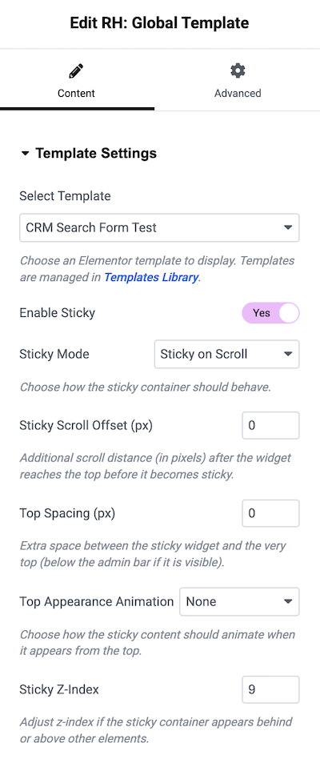

# RH: Global Template Elementor Widget

The **RH: Global Template** widget is a versatile utility provided by RealHomes that empowers you to select and display any standard Elementor saved template directly within your layouts.

This widget is particularly beneficial for maintaining consistent design elements across your website. By centralizing commonly used sections as global templates, you avoid the hassle of editing the same section individually on multiple pages—update it once, and changes reflect everywhere.

Furthermore, its advanced sticky functionalities make it an excellent choice for persistent content, such as floating banners, sidebars, or quick navigation menus that follow the user's scroll.

## Template Settings

To use this widget, drag the **RH: Global Template** widget into your Elementor page. You will find the following configuration options under the **Content** → **Template Settings** tab.

### Select Template
You can choose any pre-designed template that is saved in your Elementor **Templates Library**.

*   **Select Template:** A dropdown containing your available saved Elementor templates. If you haven't created any yet, try building one from the [Elementor Templates Library](https://elementor.com/help/template-library/).

### Sticky Functionalities

The widget brings powerful sticky behavior settings that allow the selected template to follow the user's scroll.

*   **Enable Sticky:** Toggle to "Yes" to enable the sticky behavior.
*   **Sticky Mode:** Choose how the sticky container should behave.
    *   **Sticky Default:** The content sticks natively.
    *   **Sticky on Scroll:** The content becomes sticky after the page is scrolled to its location.
*   **Sticky Scroll Offset (px):** Defines the additional scroll distance (in pixels) needed after the widget reaches the top before it becomes sticky.
*   **Top Spacing (px):** Adds extra space between the sticky widget and the very top of the screen (or just below the WordPress admin bar if it is visible). Helpful to avoid overlapping with fixed headers.
*   **Top Appearance Animation:** Pick an entry animation when the sticky effect kicks in from the top. Options include **Fade In**, **Fade In Down**, **Slide Down**, or **None**.
*   **Sticky Z-Index:** Adjust the z-index value to ensure the sticky container appears above or behind other elements properly.
