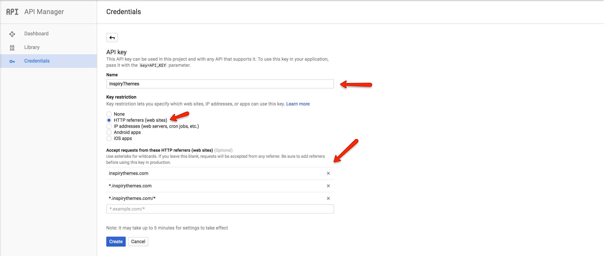
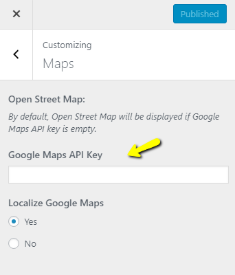
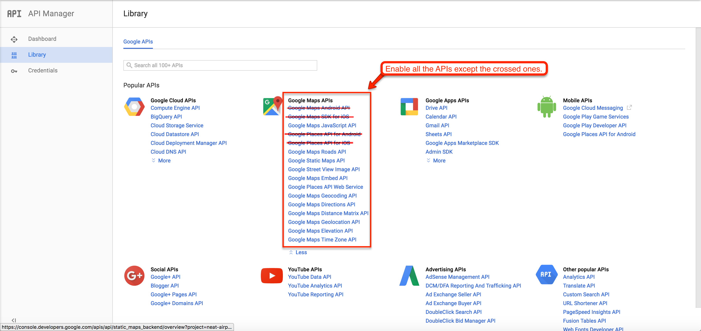

# How to get Google Maps API Key for your website

> As of June 2016, to keep Google Maps running smoothly on your website you need a special API Key. To get and setup the API Key for Google Maps please follow the instructions below.

1. Please go to **Google API Console**. and login with your google account.

2. Create a new project or select an existing project then click on **Continue** to enable the **API** and any related services.

3. Name your browser key and restrict it by adding your site URLs as shown in the screenshot below. 

4. Copy the generated **Google Maps API key** from the popup. 

5. Put this **API Key** you just copied in **Customizer** Settings (**Dashboard → Real Homes → Customize Settings → Misc → Google Maps API Key**). Click on **Close** button to proceed. 

6. By default most of the APIs are enabled but you have to enable other APIs in order to make the **Find Address** field work on **Property Edit Page**. 

**Verify Domain with Google**: [https://support.google.com/webmasters/answer/35179](https://support.google.com/webmasters/answer/35179)