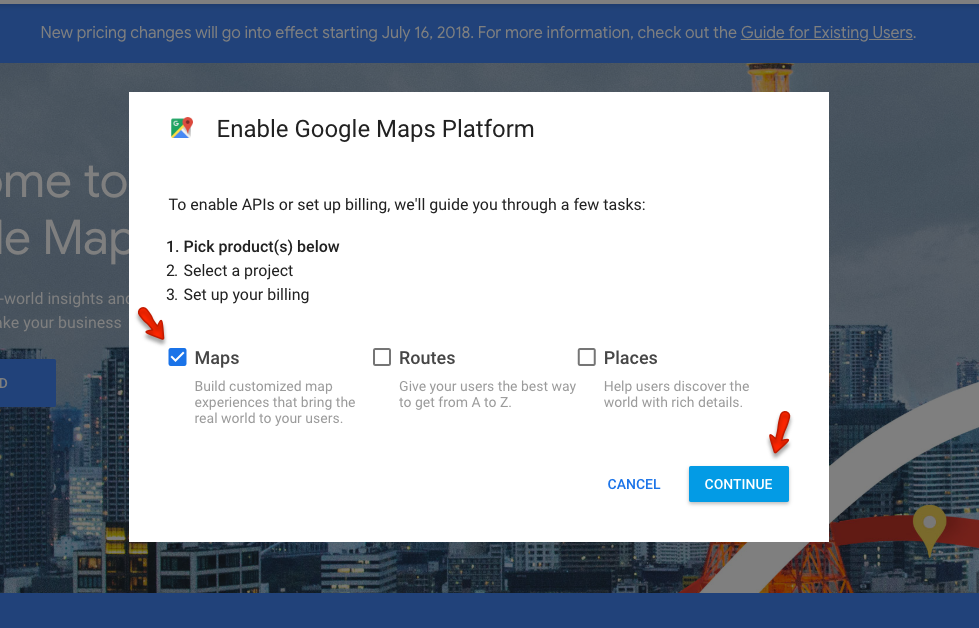
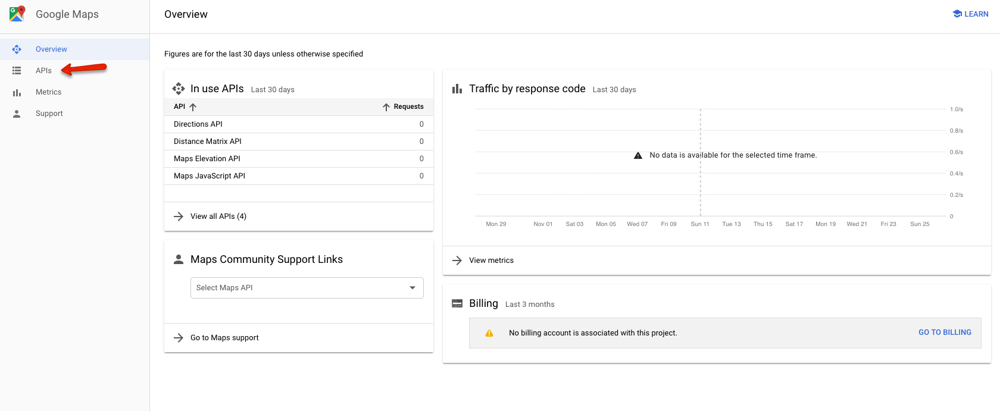
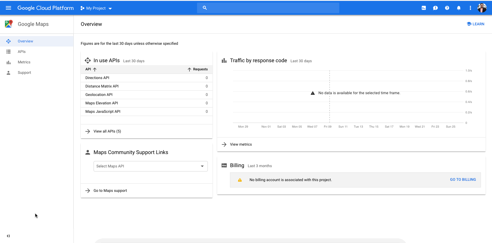
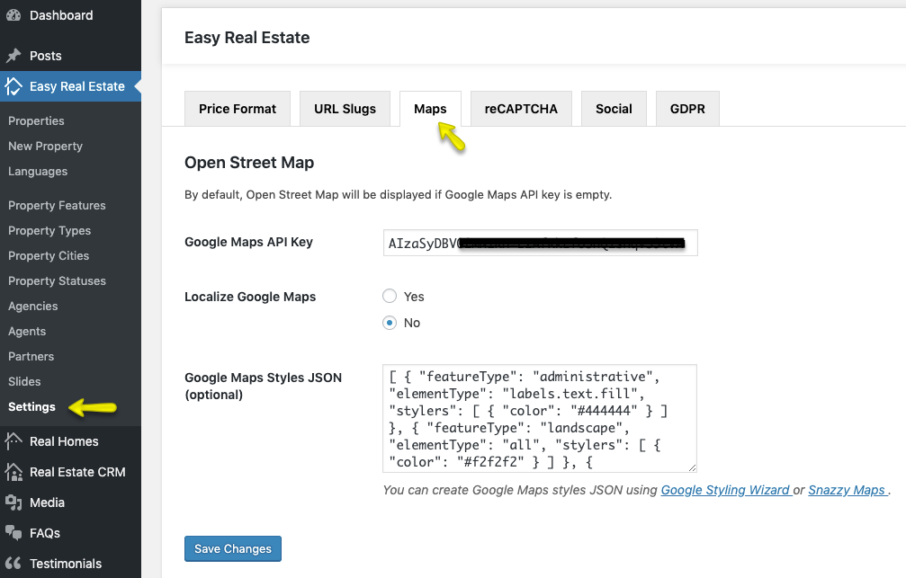

# How to get Google Maps API Key for your website

> As of June 2016, to keep Google Maps running smoothly on your website you need a special API Key. To get and setup the API Key for Google Maps please follow the instructions below. Google Maps is no longer free, and they moved it to the Google Cloud Platform. You now need to have a Google Cloud account with a credit card or bank account attached, so they can charge you if you exceed their free tiers.

### **Login & Select Maps**

Please go to [**Google API Console**](https://cloud.google.com/maps-platform/#get-started). and login with your google account. Once logged in it will display a popup so pick Maps from it.

### **Select a New or Existing Project**

Create a new project or select an existing project then click on **Continue** to enable the **API** and any related services.

### **Activate Billing for your Account**

On the next step you have to create a billing profile. You can consult the [**Official Guide of Google**](https://developers.google.com/maps/billing/gmp-billing) to learn how you can activate billing for you account.

### **Enable Maps Javascript API & Geocoding API**

After creating the billing profile navigate to the Console and click on **APIs** from the right navigation.

On this new page, click on **Maps Javascript API** and **Enable** it. Now go back to the **APIs** page and click on **Geocoding API** and **Enable** it as well. This is also needed to make the **Find Address** field work properly on **Property Edit Page**. 

### **Restrict the API Key to your Domain Only**

After activating both **APIs** in the previous step now click on the **Navigation Menu** and select **APIs & Services** and click on **Credentials**.

In this section, you will see the name of your **API Key** (so click on it) and restrict it by adding your site URLs (in 3 formats: yourdomain.com, *.yourdomain.com and *.yourdomain.com/*) as shown in the screencast below.

!!! warning "Important"
    If you don't restrict the Google Maps API Key then anyone can use it on his website because the API Key is exposed in the code. So, you must restrict the API Key to your domain only.

### **Copy the API Key and Add it**

Copy the generated **Google Maps API key** from the popup. Click on **Close** button to proceed after you copied the **API Key**. 

Put this **API Key** you just copied in **Maps** Settings (**Easy Real Estate → Settings → Maps → Google Maps API Key**).

### **Default Location for Maps on Single Property & Property Listing Pages**

In this **Maps** settings tab, you can also provide the default location for *New Property Map* and *Properties Listing Map* (when there is no property to display).

!!! info "Important Information"
    If you are running the Real Homes theme older than {==3.9.0==} version then related settings can be found by navigating to **Dashboard → Real Homes → Customize Settings → Map**

**Verify Domain with Google**: [https://support.google.com/webmasters/answer/35179](https://support.google.com/webmasters/answer/35179)
