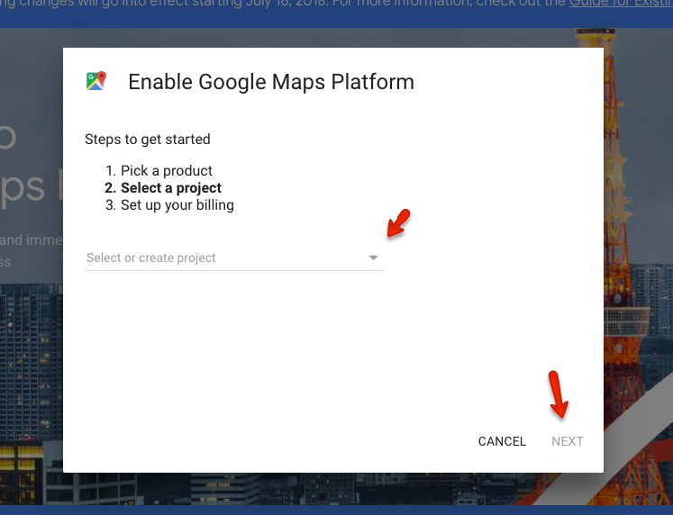
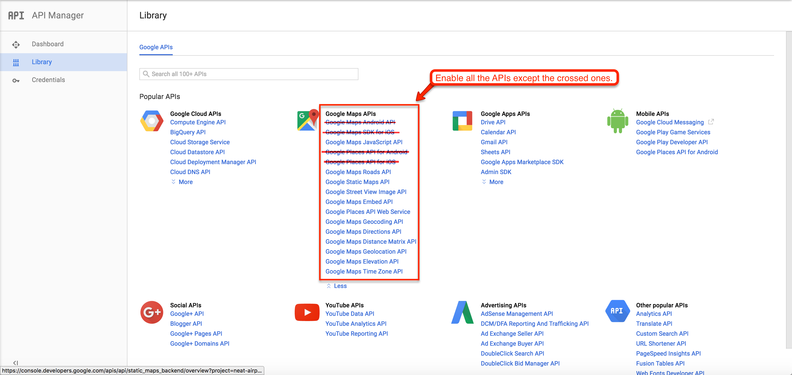

# How to get Google Maps API Key for your website

> As of June 2016, to keep Google Maps running smoothly on your website you need a special API Key. To get and setup the API Key for Google Maps please follow the instructions below. Google Maps is no longer free, and they moved it to the Google Cloud Platform. You now need to have a Google Cloud account with a credit card or bank account attached, so they can charge you if you exceed their free tiers.

1. Please go to [**Google API Console**](https://cloud.google.com/maps-platform/#get-started). and login with your google account.

2. Create a new project or select an existing project then click on **Continue** to enable the **API** and any related services.

3. Name your browser key and restrict it by adding your site URLs as shown in the screenshot below. 

4. Copy the generated **Google Maps API key** from the popup. Click on **Close** button to proceed after you copied the **API Key**. 
sdf

5. Put this **API Key** you just copied in **Customizer** Settings (**Dashboard → Real Homes → Customize Settings → Maps → Google Maps API Key**). 

6. By default most of the APIs are enabled but you have to enable other APIs in order to make the **Find Address** field work on **Property Edit Page**. 

**Verify Domain with Google**: [https://support.google.com/webmasters/answer/35179](https://support.google.com/webmasters/answer/35179)
