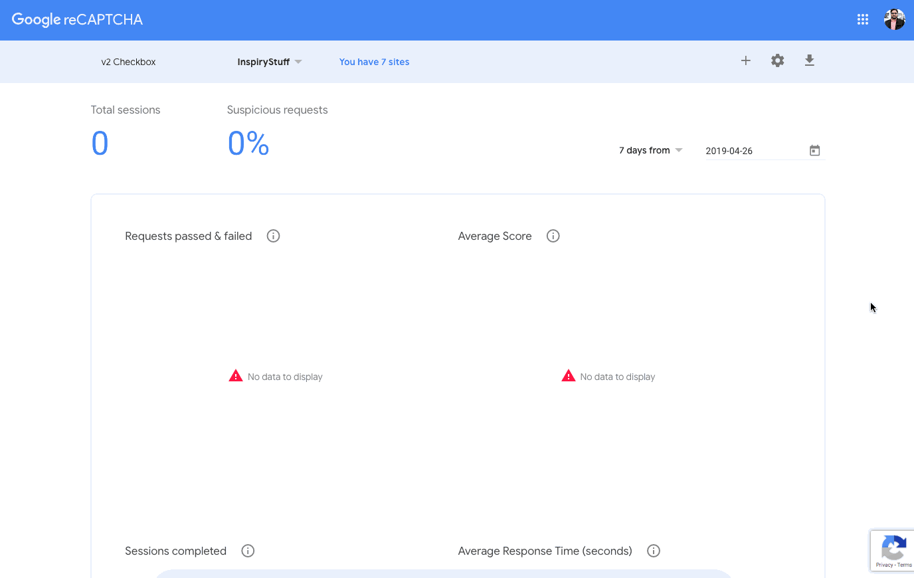
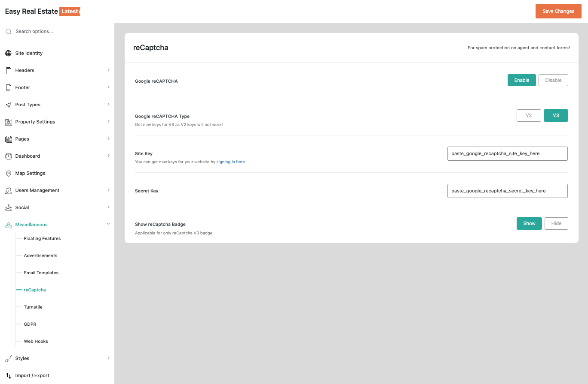
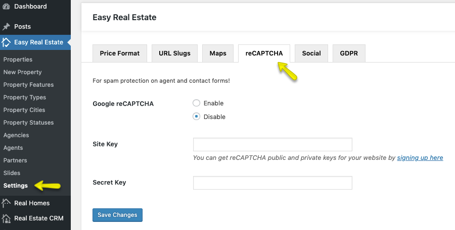

# Google reCAPTCHA Setup

To configure **Google reCAPTCHA**, you need to register your website at the [Official Google reCAPTCHA Site](https://www.google.com/recaptcha/intro/index.html) to obtain the **Site Key** and **Secret Key**.

Ensure you add your website's **URL** and select the reCAPTCHA type (**reCAPTCHA v2** or **reCAPTCHA v3**) you wish to use.

After obtaining your keys, follow the navigation path based on your version of the **RealHomes** theme:

---

### **v4.5.1 and Later**

!!! info "Navigation Path"
    **Dashboard** → **RealHomes** → **Settings** → **Miscellaneous** → **reCAPTCHA** (tab)

---

### **v4.5.0 and Earlier**

!!! info "Navigation Path"
    **Dashboard** → **Easy Real Estate** → **Settings** → **reCAPTCHA** (tab)

---

!!! info "Legacy Versions (Older than 3.9.0)"
    If you are using a version of RealHomes older than **3.9.0**, the settings can be found at:  
    **Dashboard** → **RealHomes** → **Customize Settings** → **Google reCAPTCHA**

---

Once the reCAPTCHA keys are configured, Google reCAPTCHA will be activated on all forms throughout the RealHomes theme.

---

### **Alternative: Cloudflare Turnstile**

RealHomes also supports [**Cloudflare Turnstile**](cloudflare-turnstile-setup.md), a privacy-first alternative to CAPTCHA that operates in the background without user interaction.

!!! warning "Choose One Service"
    We strongly recommend using only **one** spam protection service at a time. If you choose to enable Google reCAPTCHA, ensure that Cloudflare Turnstile is disabled to prevent both challenges from appearing on the same form.