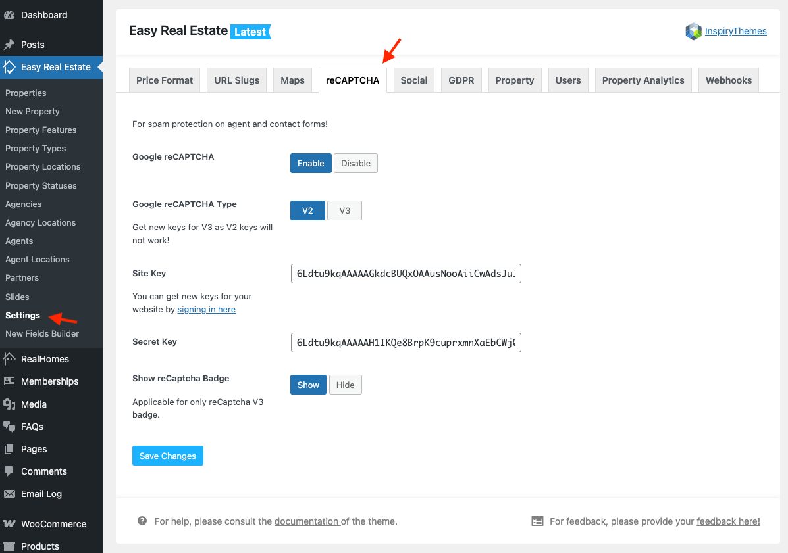

# Google reCAPTCHA

To configure **Google reCAPTCHA** you need to register your website at [Visit Google reCAPTCHA Site](https://www.google.com/recaptcha/intro/index.html) and get public and private keys for your website after successful registration.

Please note that you must add the **URL of YOUR website** and select reCAPTCHA type **reCAPTCHA V2** or **reCAPTCHA V3** that you want to use.

 

After that use those keys to fill the related fields in **Easy Real Estate → Settings → reCAPTCHA** as displayed below.

!!! info "Important Information"
    If you are running the RealHomes Theme older than {==3.9.0==} version then related settings can be found by navigating to **Dashboard → RealHomes → Customize Settings → Google reCAPTCHA**

Once reCAPTCHA keys are configured, Google reCAPTCHA will be activated on all forms throughout the RealHomes Theme.