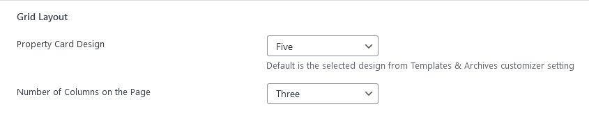

# Grid Layout Variations & Card Settings

### **Grid Layout Variations**

Grid Listing templates comes with **5 different Property Card Designs**. You can select any layout of your choice with the number of columns to divide the cards.

**Publish** the page once it is ready.

### **Grid Card Settings**

You can change the **Properties Card's** settings for **Grid Layout** in **Dashboard → Real Homes → Customize Settings → Various Pages → List Templates & Taxonomy Archives**.

