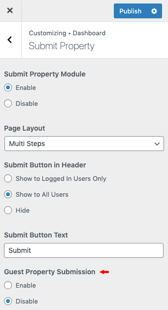

# Guest Property Submission

Streamline the property submission process on your website by enabling the **Guest Property Submission** feature. Avoid the hassle of user registrations while still allowing seamless property submissions.

!!! info "Important"

    To enable the Guest Property Submission feature, it is essential to configure the Dashboard correctly. For detailed instructions on setting up the Dashboard, please refer to our comprehensive documentation available <a target="_blank" href="https://realhomes.io/documentation/dashboard/">here</a>.

Simply navigate to **Dashboard → RealHomes → Customize Settings → Dashboard → Submit Property** to enable the **Guest Property Submission** and enhance the user experience.

