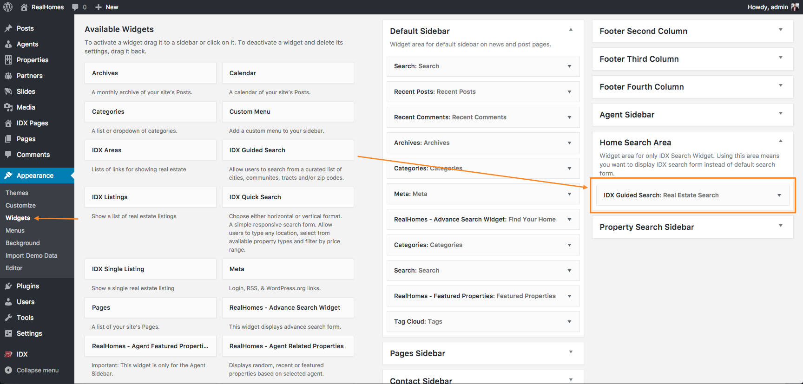
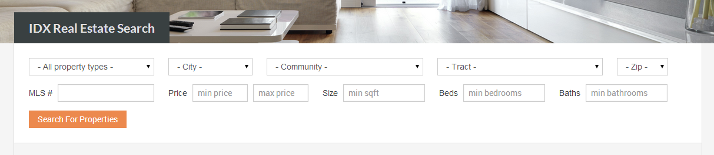

# dsIDXpress Search Widget on Homepage

Follow the steps below to use the **dsIDXpress Search Widget** on homepage.

1. Go to **Dashboard → Appearance → Widgets**

2. Look for the widget area named **Home Search Area** and put **IDX Guided Search** widget in it.

3. After that visit the homepage and you wil have the **dsIDXpress Search Widget** in place of Real Homes default search form.

