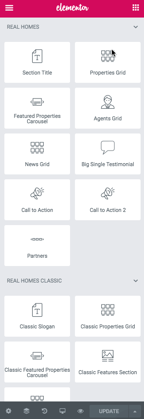

# Create Home Page with Elementor

Since version 3.8.0, you get **Elementor Page Builder** with **Real Homes Theme main** package so you can add the  content easily using Elementor Page Builder. It comes with **14 Elementor Custom Widgets of Real Homes Theme** which means you will find 14 custom widgets in Elementor's panel with lots of customizable options and settings.

If you are unfamiliar with **Elementor Page Builder** then you can check out their [getting started guide](https://docs.elementor.com/collection/1-getting-started).

## Use Real Homes Elementor Widgets in any Design

The good thing is now you can add the elements of Modern or Classic design anywhere regardless of which Design you are using. For example, you can add Classic Properties Grid to Modern Design or vice versa using Elementor.

## Create Home Page

To set up the Home page you need to create a new page. In order to do so go to **Dashboard → Pages → Add New**. You can give this page a title "**Home**" yet you do not need to include any contents for now.

Select the “**Home**” template from the **Page Attributes** section, as displayed in screen shot below and click “**Publish**”.

## Add Real Homes Widgets with Elementor

First of all, to edit the home page with Elementor simple click on **Edit with Elementor** button. It will redirect you to the **Elementor's Editing Mode** where you will have **Elementor's Widget Panel** on left and **Home Page's Preview** on the right.

### **Container Settings**

The very first step is to set a full width container with no gaps. Please check out the following video.

<iframe width="688" height="387" src="https://www.youtube.com/embed/BWpxOLYdGJU" frameborder="0" allow="accelerometer; autoplay; encrypted-media; gyroscope; picture-in-picture" allowfullscreen></iframe>

To add any Real Homes Widget simply drag the widget to the right as shown in the following videos (**double click** to **video** for **full screen** mode).

### **Adding Properties Grid**

<iframe width="688" height="387" src="https://www.youtube.com/embed/kE66P-9dhTo" frameborder="0" allow="accelerometer; autoplay; encrypted-media; gyroscope; picture-in-picture" allowfullscreen></iframe>

### **Adding Featured Properties Carousel**

<iframe width="688" height="387" src="https://www.youtube.com/embed/asTuo2Xubak" frameborder="0" allow="accelerometer; autoplay; encrypted-media; gyroscope; picture-in-picture" allowfullscreen></iframe>

### **Adding Call to Action**

<iframe width="688" height="387" src="https://www.youtube.com/embed/nSxo7p-K3Tw" frameborder="0" allow="accelerometer; autoplay; encrypted-media; gyroscope; picture-in-picture" allowfullscreen></iframe>

### **Adding Agents Grid**

<iframe width="688" height="387" src="https://www.youtube.com/embed/zhlkpMwHSMA" frameborder="0" allow="accelerometer; autoplay; encrypted-media; gyroscope; picture-in-picture" allowfullscreen></iframe>

### **Adding News / Posts Grid**

<iframe width="688" height="387" src="https://www.youtube.com/embed/Ub5ZbjIWznM" frameborder="0" allow="accelerometer; autoplay; encrypted-media; gyroscope; picture-in-picture" allowfullscreen></iframe>

### **Adding Amazing Features**

<iframe width="688" height="387" src="https://www.youtube.com/embed/BB4r6ZCxcIY" frameborder="0" allow="accelerometer; autoplay; encrypted-media; gyroscope; picture-in-picture" allowfullscreen></iframe>

### **Adding Big Testimonial**

<iframe width="688" height="387" src="https://www.youtube.com/embed/-QT42NcuaeQ" frameborder="0" allow="accelerometer; autoplay; encrypted-media; gyroscope; picture-in-picture" allowfullscreen></iframe>

### **Adding Partners Section**

<iframe width="688" height="387" src="https://www.youtube.com/embed/WrP9prsTYm8" frameborder="0" allow="accelerometer; autoplay; encrypted-media; gyroscope; picture-in-picture" allowfullscreen></iframe>

## **Set as Home Page**

To set this page which you just created as your home page please visit [Configure Reading Settings](https://realhomes.io/documentation/home-page-setup/#configure-reading-settings)
