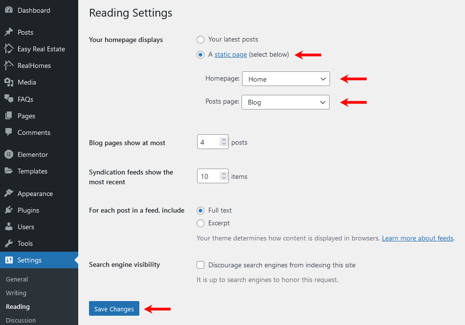

# Create Home Page with Elementor

Since version 3.8.0, we have integrated Elementor into Real Homes Theme so our customers can add content conveniently using Elementor Page Builder. We have added **14 widgets of Real Homes Theme in Elementor** which means you will find 14 custom widgets of the theme in Elementor's panel.

## Create Home Page

To set up the Home page you need to create a new page. In order to do so go to **Dashboard → Pages → Add New**. You can give this page a title "**Home**" yet you do not need to include any contents for now.

Select the “**Home**” template from the **Page Attributes** section, as displayed in screen shot below and click “**Publish**”.

# Add Real Homes Widgets with Elementor

First of all, to edit the home page with Elementor simple click on **Edit with Elementor** button. It will redirect you to the **Elementor's Editing Mode** where you will have **Elementor's Widget Panel** on left and **Home Page's Preview** on the right.

To add any Real Homes Widget simply drag the widget to the right as shown in the following video (**double click** to **video** for **full screen** mode).

<iframe width="688" height="387" src="https://www.youtube.com/embed/emZsijVk-fY" frameborder="0" allow="accelerometer; autoplay; encrypted-media; gyroscope; picture-in-picture" allowfullscreen></iframe>

## Configure Reading Settings

To configure reading settings you need to visit **Dashboard → Settings → Reading** and choose that front page displays as static page. Then select **Home** as **Front Page** and **News** as **Posts Page**. As, displayed in screen shot below.

