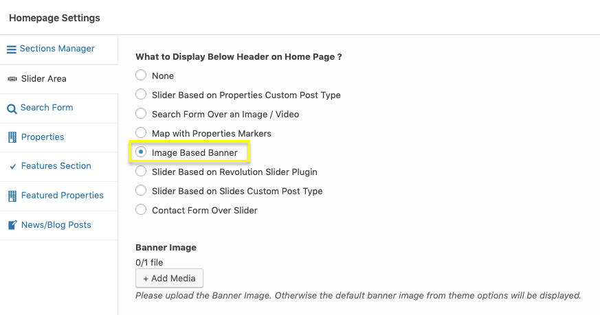
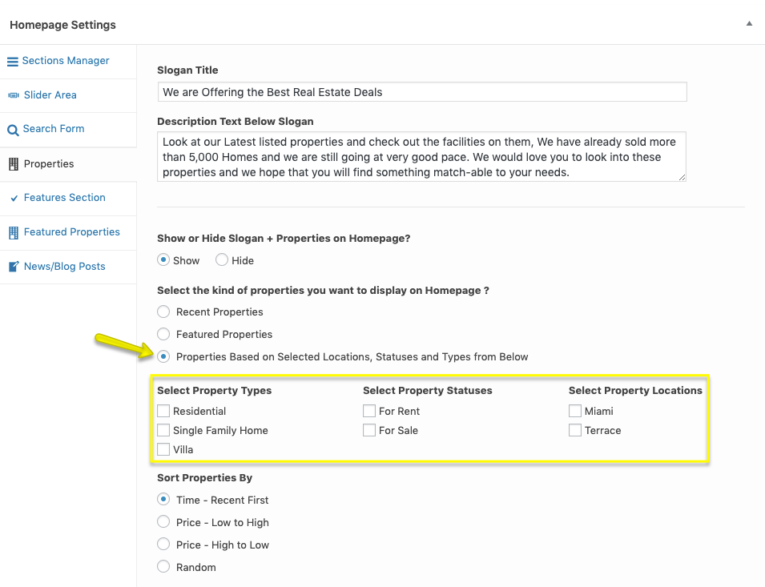
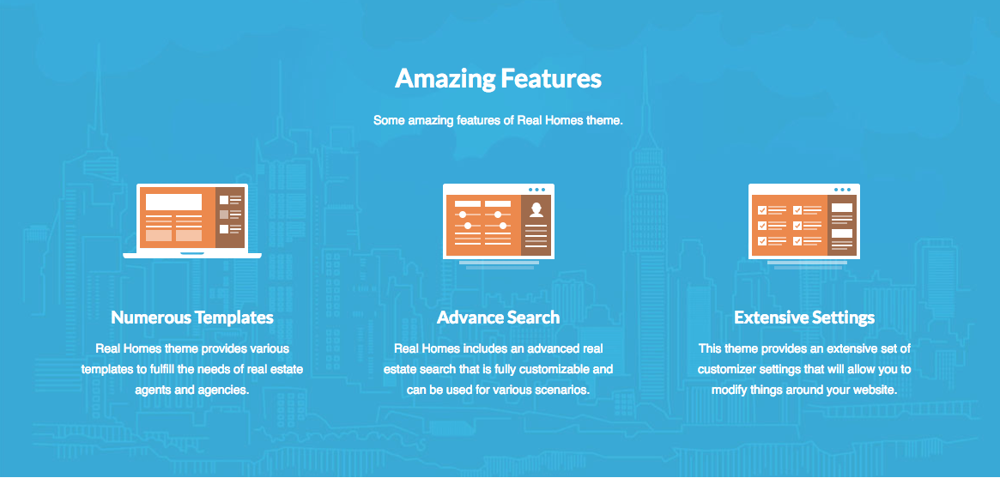

# Create and Configure Home Page

## Create Home Page

In case you have Imported Demo Contents the home page is already created and you do not need to follow this section.

To set up the Home page you need to create a new page. In order to do so go to **Dashboard → Pages → Add New**. You can give this page a title "**Home**" yet you do not need to include any contents for now.

Select the “**Home**” template from the **Page Attributes** section, as displayed in screen shot below and click “**Publish**”.

## Configure Reading Settings

To configure reading settings you need to visit **Dashboard → Settings → Reading** and choose that front page displays as static page. Then select **Home** as **Front Page** and **News** as **Posts Page**. As, displayed in screen shot below.

## Home Page Settings (Classic)

Navigate to **Dashboard → Real Homes → Customize Settings** and look into **Home Page** panel to explore further sections.

### **Sections Manager**

If you want to change the order of the sections of home page then you can use **Sections Manager**.

**Sections Manager** gives you control over the sections order of home page, for example, you can display the blog posts section as first instead of featured properties section or you can put Features section at the top or in the middle.

Navigate to **Dashboard → Real Homes → Customize Settings → Home Page → Sections Manager**. To change the order of the sections you can just drag and drop.

**Note**: Sections Manager is not yet available for Modern Design layout of Real Homes Theme.

### **Search Form Over Image**

Navigate to **Dashboard → Real Homes → Customize Settings → Home Page → Slider Area** and choose related option as displayed in screenshot below.

For **Properties Search Form** settings, Check out related section in this documentation.

### **Display Google Maps**

Adding google map on homepage is super simple as properties already have their locations stored in database. So, Navigate to **Dashboard → Real Homes → Customize Settings** and Go to section **Home Page → Slider Area** and choose related option as shown in below screenshot.

**Note**: To enable **Google Maps** for your website, You need to configure **Google Maps API key** under **Dashboard → Real Homes → Customize Settings → Misc** panel.

### **Display Image Banner**

To display image banner on homepage, Navigate to **Dashboard → Real Homes → Customize Settings** and Go to section **Home Page → Slider Area** and choose banner related option as displayed in screenshot below.

After that you can provide banner image for overall site from **Header → Banner** section in customizer.

OR you can provide the banner image for home page only by editing it's page and using **Top Banner Area Settings** meta box, as displayed in screen shot below.

### **Slogan on Home Page**

Navigate to **Dashboard → Real Homes → Customize Settings** and look for **Home Page** section. It contains **Slogan** section where you can change slogan text and description text.

### **Properties on Home Page**

Navigate to **Dashboard → Real Homes → Customize Settings** and look for **Home Page → Home Properties** section for related settings.

### **Filter Properties**

To display properties related to on or more particular locations, statuses or types you can use related settings displayed in screen shot below.

### **Properties Sorting, Number of Properties and AJAX Pagination**

### **Features Section**

Navigate to **Dashboard → Real Homes → Customize Settings** and look for **Home Page → Features Section** for related settings.

Add Featrue Image, Feature Title, Feature Description and Feature URL for three columns to show Features Section on Home Page.

Features Section will be visible when all three features are filled.

### **Featured Properties on Home Page**

Navigate to **Dashboard → Real Homes → Customize Settings** and look for **Home Page → Featured Properties** section for related settings.

### **News Posts on Home Page**

Navigate to **Dashboard → Real Homes → Customize Settings** and look for **Home Page → News** or Blog Posts section for related settings.

## Home Page Settings (Modern)

### **Home Page Settings**

Navigate to **Dashboard → Real Homes → Customize Settings** and look into **Home Page** panel to explore further sections.

### **Display Google Maps**

Adding google map on homepage is super simple as properties already have their locations stored in database. So, Navigate to **Dashboard → Real Homes → Customize Settings** and Go to section **Home Page → Slider Area** and choose related option as shown in below screenshot.

**Note**: To enable **Google Maps** for your website, You need to configure **Google Maps API key** under **Dashboard → Real Homes → Customize Settings → Misc** panel.

### **Properties on Home Page**

Navigate to **Dashboard → Real Homes → Customize Settings** and look for **Home Page → Home Properties** section for related settings.

### **Filter Properties**

To display properties related to on or more particular locations, statuses or types you can use related settings displayed in screen shot below.

### **Properties Sorting, Number of Properties and Section Styles**

### **Featured Propertiese**

Navigate to **Dashboard → Real Homes → Customize Settings** and look for **Home Page → Featured Properties** section for related settings.

### **Testimonial**

Navigate to **Dashboard → Real Homes → Customize Settings** and look for **Home Page → Testimonial** for related settings.

### **Agents Section**

Navigate to **Dashboard → Real Homes → Customize Settings** and look for **Home Page → Agents Section** for related settings.

### **Features Section**

Navigate to **Dashboard → Real Homes → Customize Settings** and look for **Home Page → Features Section** for related settings.

