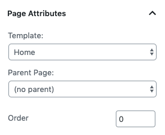

# Create and Configure Home Page

## Create Home Page

In case you have Imported Demo Contents the home page is already created and you do not need to follow this section.

To set up the Home page you need to create a new page. In order to do so go to **Dashboard → Pages → Add New**. You can give this page a title "**Home**" yet you do not need to include any contents for now.

Select the “**Home**” template from the **Page Attributes** section, as displayed in screen shot below and click “**Publish**”.

## Configure Reading Settings

To configure reading settings you need to visit **Dashboard → Settings → Reading** and choose that front page displays as static page. Then select **Home** as **Front Page** and **News** as **Posts Page**. As, displayed in screen shot below.

