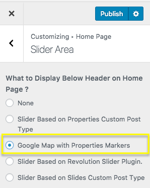

# Display Google Maps on Homepage

Adding google map on homepage is super simple as properties already have their locations stored in database. So, Navigate to **Dashboard → Appearance → Customize** and Go to section **Home Page → Slider Area** and choose related option as shown in below screenshot.

 
**Note**: To enable **Google Maps** for your website, You need to configure **Google Maps API key** under **Dashboard → Appearance → Customize → Misc** panel.