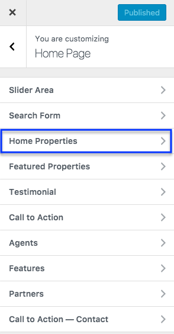
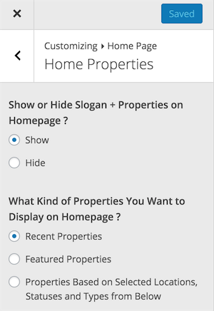

# Properties on Home Page

Navigate to **Dashboard → Appearance → Customize** and look for **Home Page → Home Properties** section for related settings.

### Filter Properties on Home Page

To display properties related to on or more particular locations, statuses or types you can use related settings displayed in screen shot below.

### Properties Sorting, Number of Properties to Display and AJAX Pagination

