## Homepage Settings (Classic)

You can configure **Homepage Settings** from its add/edit page.

### **Sections Manager**

**Sections Manager** gives you control over the sections order of Homepage, for example, you can display the blog posts section as first instead of featured properties section or you can put Features section at the top or in the middle.

To change the order of the sections you can drag and drop them in the **Sections Manager** tab.

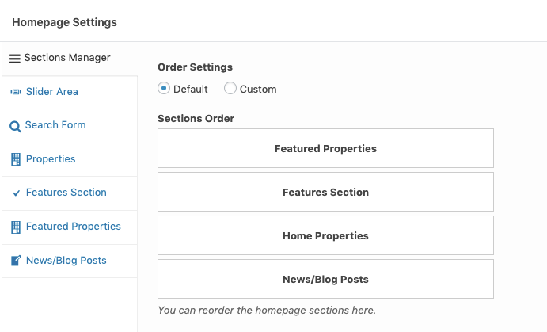

### **Home Page Slider**
You can feed slider contents from following sources

1. **Properties Custom Post Type** - It will attach properties to your slides ( Very easy to use )
2. **Revolution Slider** - You can add text,images, buttons and videos the way you want. ( Little difficult to use but awesome results )
3. **Slides Custom Post Type** - You can attach a simple image to your slide with related text data ( easy to use with results similar to properties based slider )

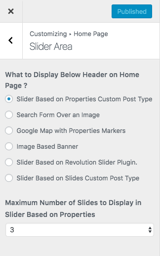

#### 1. Properties Based Slider ####

Visit the slider settings as guided above and choose **Slider Based on Properties Custom Post Type** as displayed in screenshot above.

If you want to include a property in homepage slider, Then you need to edit that property and look for metabox field with tab title **"Homepage Slider"**. Open the tab and select **Yes** plus provide slide image as required by **Slider Image** field in screen shot below it.

#### 2. Revolution Slider ####

Look for the folder name **Plugins/Revolution** Slider in unzipped package downloaded from themeforest.net. This folder will contain revolution slider's plugin zip, documentation and demo slider import zip. You need to go to **Plugins → Add New** in your WordPress dashboard side and upload the **revslider.zip** as displayed in image below.

After installing and activating Revolution Slider please navigate to **Dashboard → Slider Revolution** and click on **Import Slider** as shown in this screenshot below. The zip file of the slider is located in the main package of Real Homes Theme (**rh-main-package → Plugins → Revolution Slider → realhomes-slider-zip → realhomes.zip**).

Once the slider is imported then set it in the **Homepage Settings → Slider Area → What to Display Below Header on Home Page ?** option as **Slider Based on Revolution Slider Plugin** and set **Revolution Slider Alias** as **realhomes**.

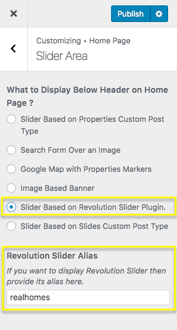

#### 3. "Slides" Custom Post Type Based Slider ####

To display slider based on slides custom post type, You need to add new slides as displayed in screenshot below.

After adding slides go to **Homepage Settings → Slider Area** and choose **Slider Based on Slides Custom Post Type** as displayed in screenshot below.

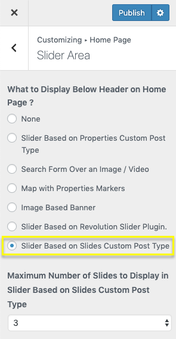

### **Search Form Over Image**

Navigate to **Homepage Settings → Slider Area** and choose related option as displayed in screenshot below.

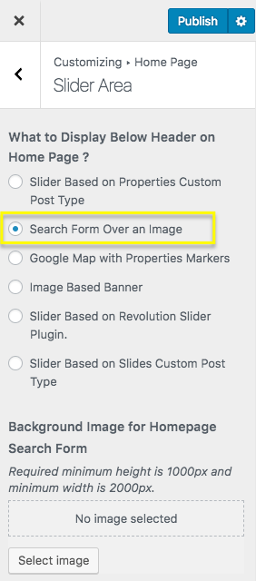

For **Properties Search Form** settings, Check out related section in this documentation.

### **Display Google Maps**

Adding google map on homepage is super simple as properties already have their locations stored in database. So, Go to **Homepage Settings → Slider Area** tab and choose related option as shown in below screenshot.

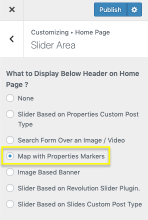

!!! note
    To enable Google Maps for your website, You need to configure **Google Maps API key** by navigating to **Easy Real Estate → Settings → Maps**.

### **Display Image Banner**

To display image banner on homepage, Go to **Homepage → Slider Area** tab and choose banner related option as displayed in screenshot below.

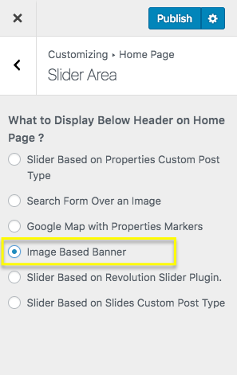

After that you can provide banner image for the Homepage **OR** for overall site from **Header → Banner** section in customizer.

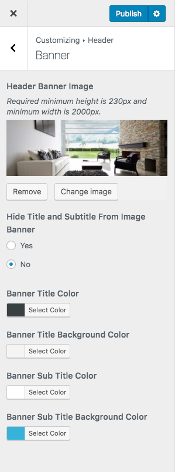

### **Slogan on Home Page**

Navigate to **Dashboard → Real Homes → Customize Settings** and look for **Home Page** section. It contains **Slogan** section where you can change slogan text and description text.

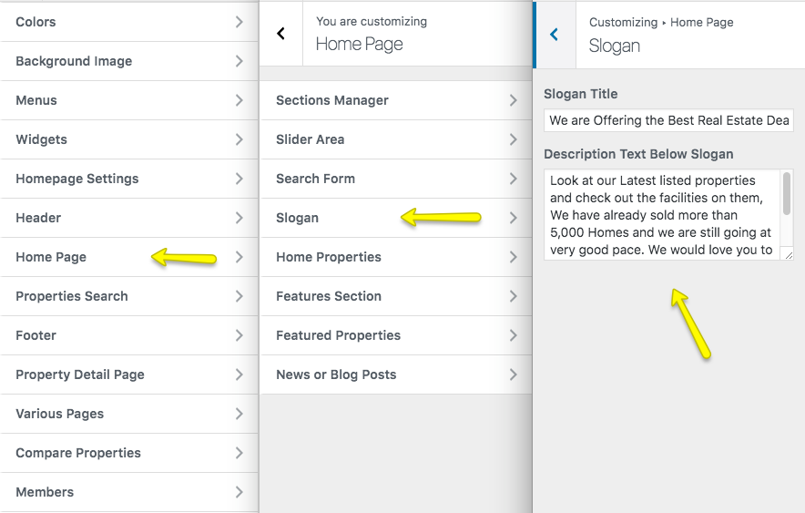

### **Properties on Home Page**

Navigate to **Dashboard → Real Homes → Customize Settings** and look for **Home Page → Home Properties** section for related settings.

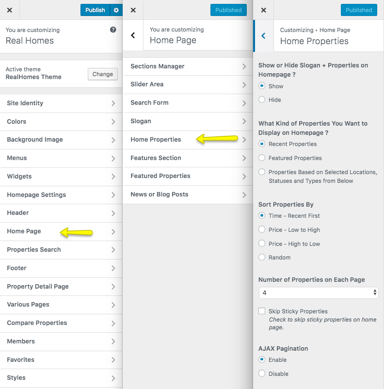

### **Filter Properties**

To display properties related to on or more particular locations, statuses or types you can use related settings displayed in screen shot below.

### **Properties Sorting, Number of Properties and AJAX Pagination**

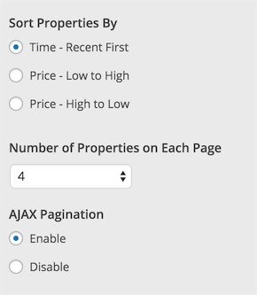

### **Features Section**

Navigate to **Dashboard → Real Homes → Customize Settings** and look for **Home Page → Features Section** for related settings.

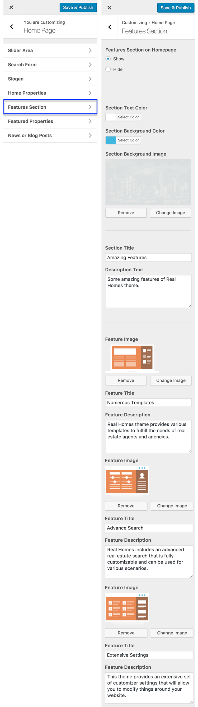

Add Featrue Image, Feature Title, Feature Description and Feature URL for three columns to show Features Section on Home Page.

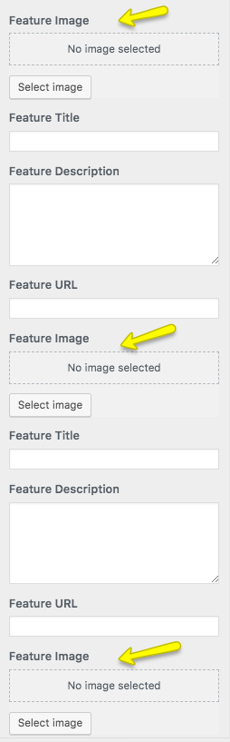

Features Section will be visible when all three features are filled.

### **Featured Properties on Home Page**

Navigate to **Dashboard → Real Homes → Customize Settings** and look for **Home Page → Featured Properties** section for related settings.

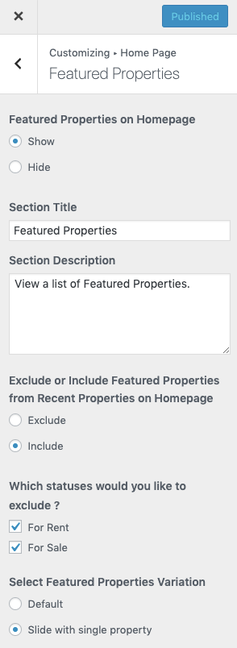

### **News Posts on Home Page**

Navigate to **Dashboard → Real Homes → Customize Settings** and look for **Home Page → News** or Blog Posts section for related settings.

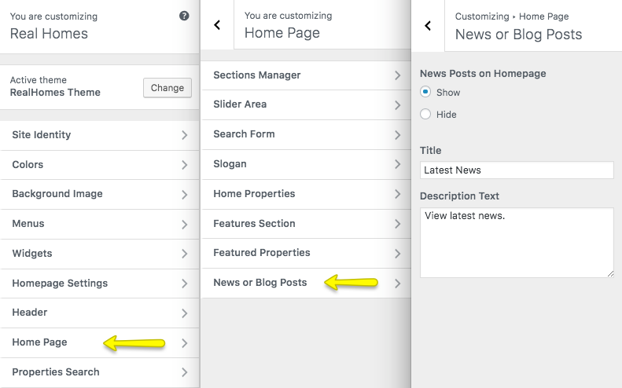
