# Homepage Settings (Modern)

The **Modern** design of RealHomes offers a flexible, widget-based homepage layout. You can configure everything directly from the page editor.

## **Accessing Homepage Settings**

1.  Go to **Dashboard → Pages**.
2.  Find the page you've set as your **Front Page** (usually named "Home").
3.  Click **Edit**.
4.  Scroll down to the **Homepage Settings** meta box.

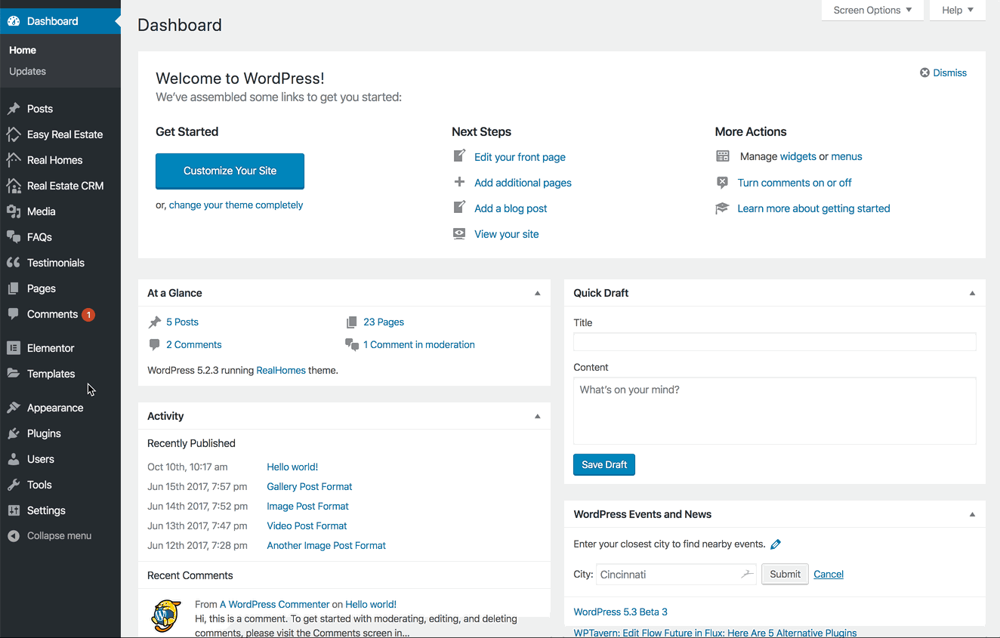

---

## **1. Sections Manager**

Control the layout of your homepage with the **Sections Manager**.
Want the Blog section at the top? Or maybe the Features section right after the slider?

*   **Drag and Drop** sections to reorder them using the handle on the left.
*   **Show/Hide** sections using the eye icon.

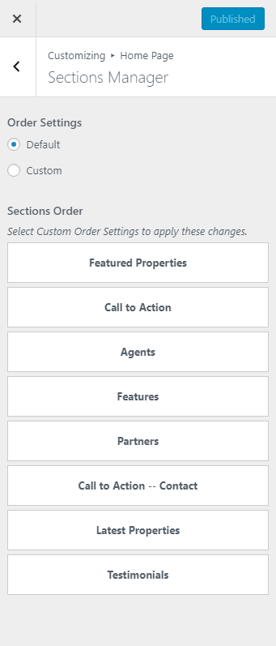

---

## **2. Slider Area**

The top section of your homepage is the most visual part. You have **7 different options** to choose from in the **Slider Area** tab.

### **Available Slider Types**

1.  **Properties Custom Post Type:** Automatically creates slides from your properties. (Simplest & Most Popular)
2.  **Search Form Over Image/Video:** A large background image or video with the search form front and center.
3.  **Map with Properties Markers:** Displays a Google Map with pins for your properties.
4.  **Image Based Banner:** A static banner image (like standard sub-pages).
5.  **Revolution Slider:** Use the powerful Slider Revolution plugin for complex, animated sliders.
6.  **Slides Custom Post Type:** Create custom slides manually (Image + Text) without linking to specific properties.
7.  **Contact Form Over Slider:** Displays a contact form over a background image.

---

### **Configuring Your Slider**

#### **Option 1: Properties Based Slider**
Select **Slider Based on Properties Custom Post Type**.
To add a property to the slider:
1.  Edit a Property.
2.  Look for the **Homepage Slider** tab in the *Property Meta Box*.
3.  Select **Yes** and upload a **Slider Image**.

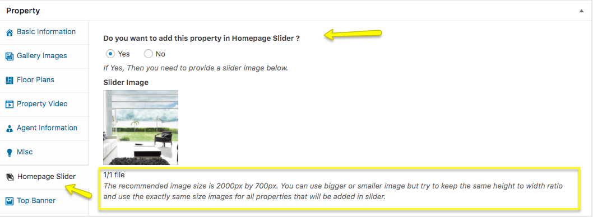

#### **Option 2: Search Form Over Image / Video**
Select **Search Form Over Image / Video**.
*   Upload your background image/video directly in the settings.
*   Configure the search form fields in **RealHomes → Customize Settings → Properties Search**.

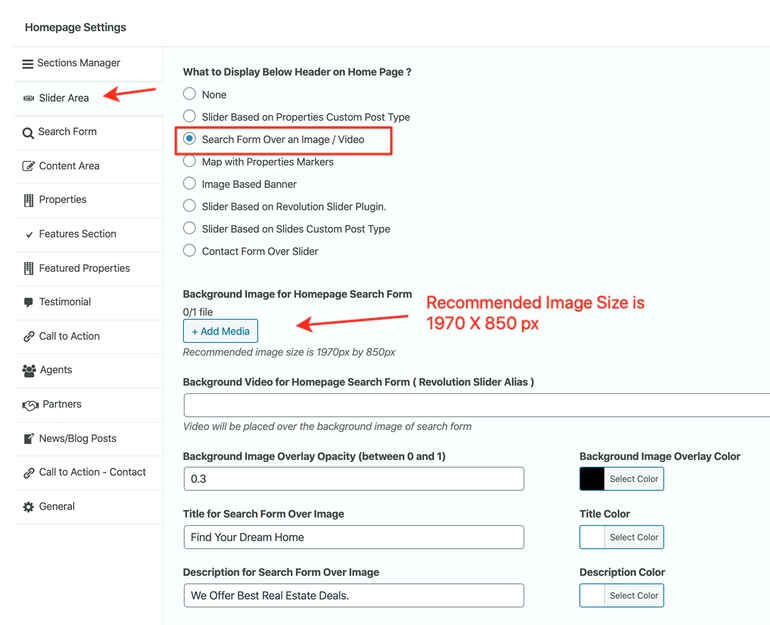

#### **Option 3: Map with Properties Markers**
Select **Map with Properties Markers**.
*   Ensures your [Google Maps API Key](google-maps-setup.md) is configured.
*   The map will automatically display pins for properties with locations.

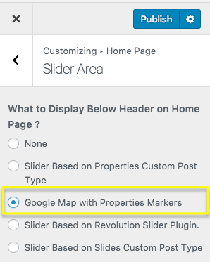

#### **Option 4: Image Banner**
Select **Image Based Banner** for a simple, static header.

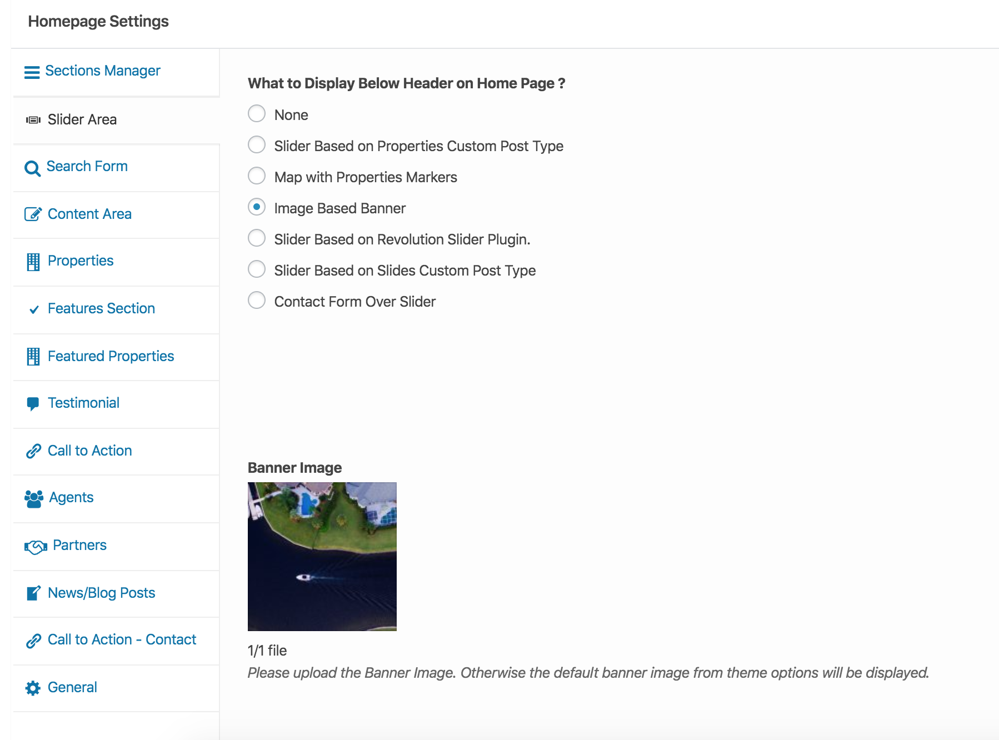

#### **Option 5: Revolution Slider**
Select **Slider Based on Revolution Slider Plugin**.
*   Enter the **Revolution Slider Alias** (e.g., `realhomes`).
*   *Note:* You must install and import the demo slider first via **Dashboard → Slider Revolution**.

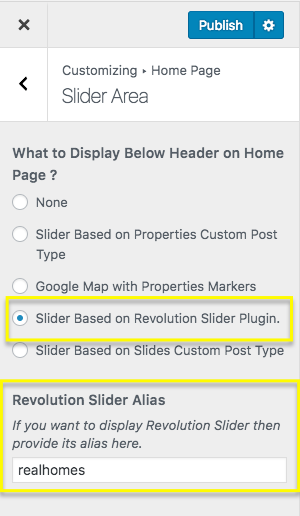

#### **Option 6: Slides Custom Post Type**
Select **Slider Based on Slides Custom Post Type**.
*   Create slides in **Dashboard → Slides → Add New**.
*   They will automatically appear here.

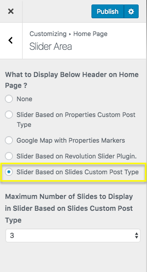

#### **Option 7: Contact Form Over Slider**
Select **Contact Form Over Slider** for lead generation focus.

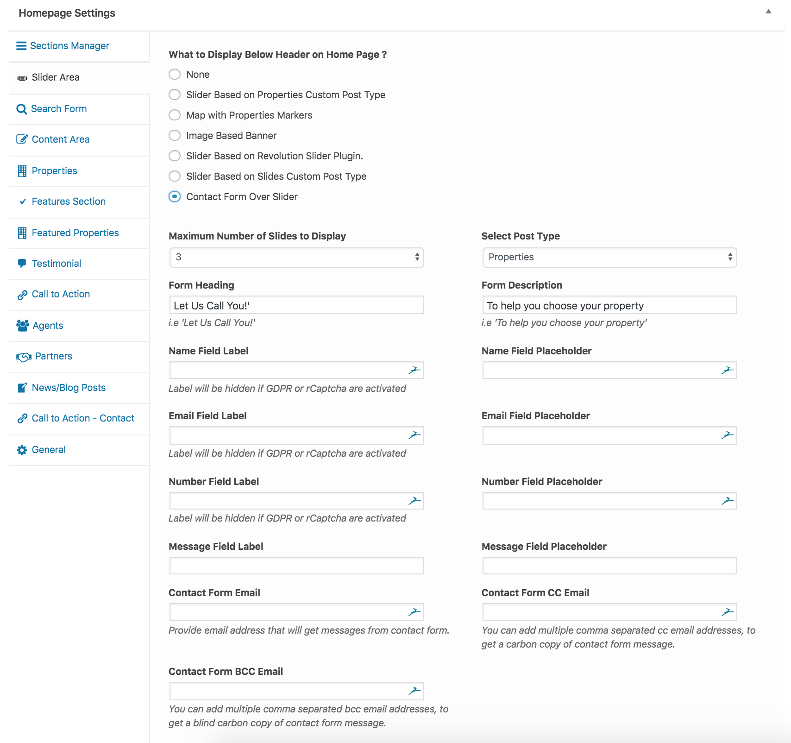

---

## **3. Homepage Content Modules**

Configure the other sections of your homepage by clicking their respective tabs.

### **Search Form**
Customize the search form appearance if it's not part of the slider.

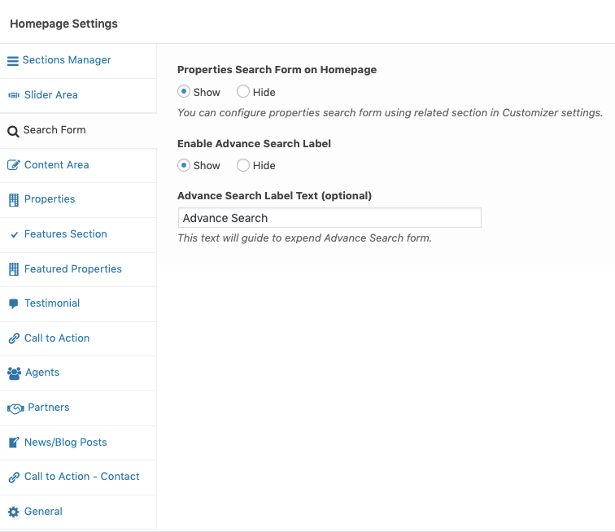

### **Content Area**
Display standard page content (text/images from the WordPress editor) on the homepage.

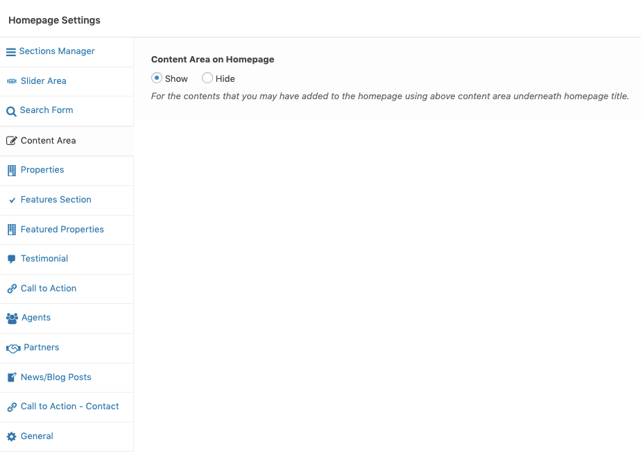

### **Properties Section**
Select which properties to show (Recent, Featured, etc.) and layout styles (Grid/List).

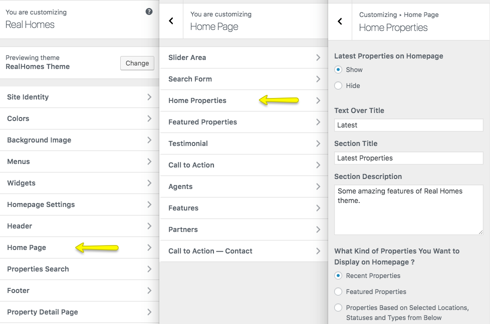

**Filter Properties:**
You can also restrict the properties shown by Location, Status, or Type.

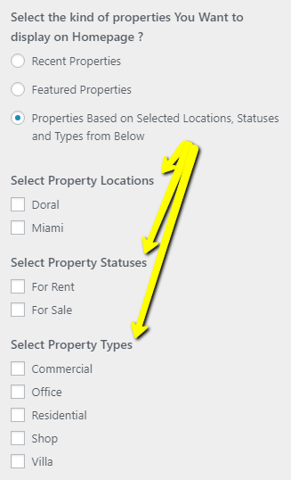

### **Features Section**
Highlight your agency's strengths (e.g., "Trusted by Thousands").
*   Click **+ Add more** to add multiple features (Icon, Title, Description).

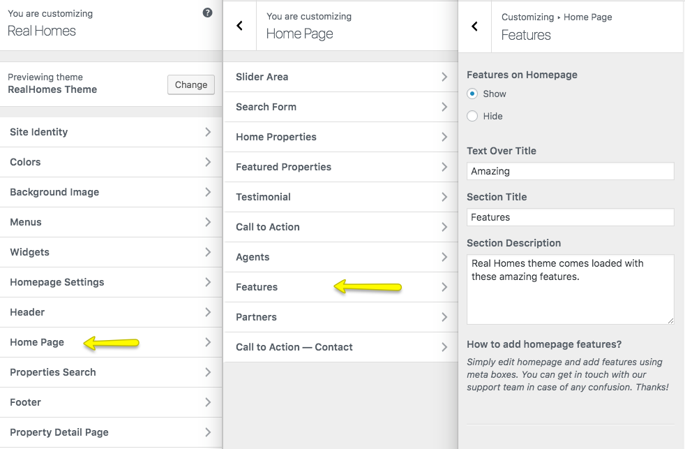

### **Featured Properties**
A dedicated section for your top listings.

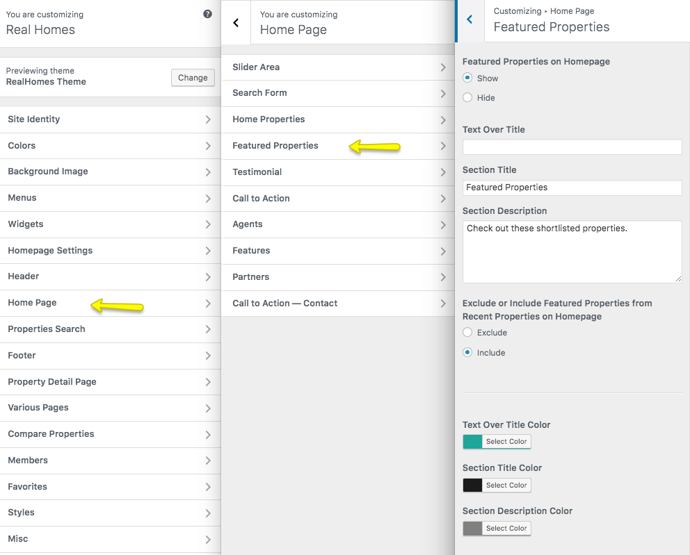

### **Testimonials**
Showcase client feedback.

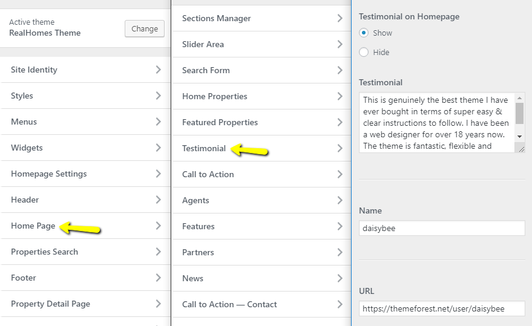

### **Agents & Partners**
Display your team and business partners.

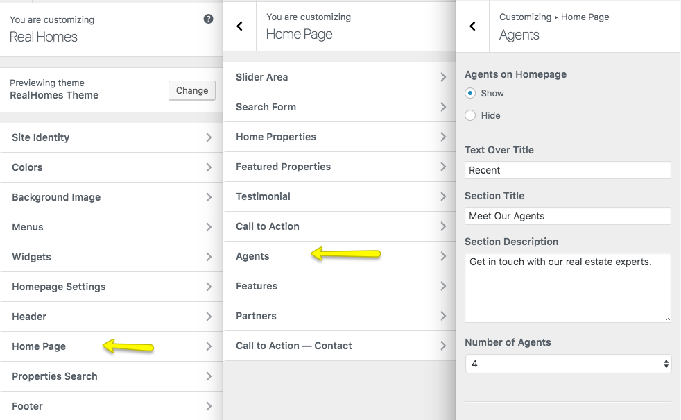

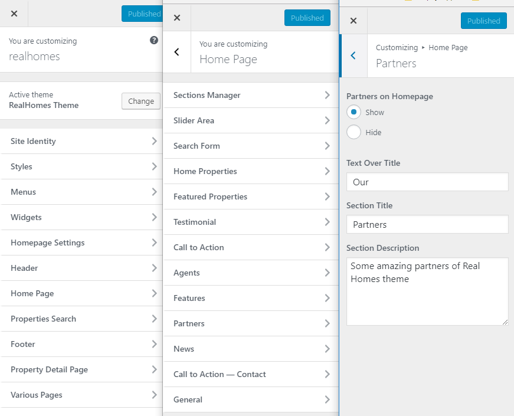

### **News / Blog Posts**
Show your latest blog articles.

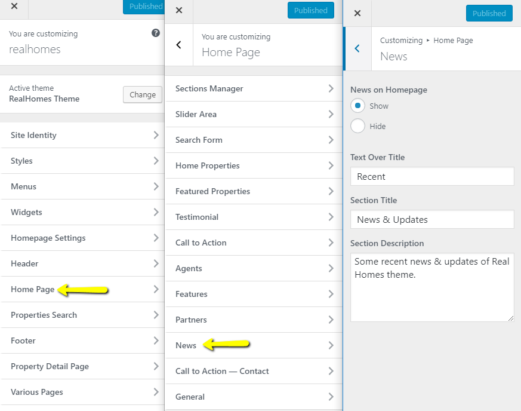

### **Call to Action (CTA)**
Add a banner encouraging users to "Contact Us" or "Submit Property".

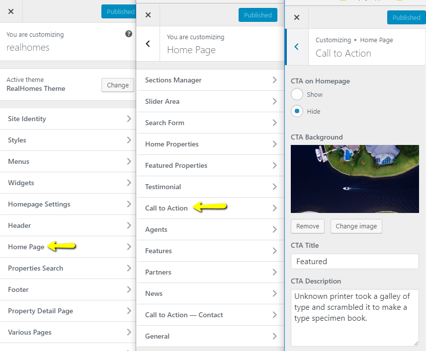

---

## **4. General Settings (Diagonal Design)**

Want that stylish diagonal look?
Go to the **General** tab to control the **Sections Border Angle**.
*   **Diagonal**: Adds the angled separators.
*   **Flat**: Uses standard horizontal lines.

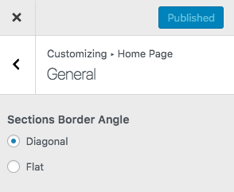