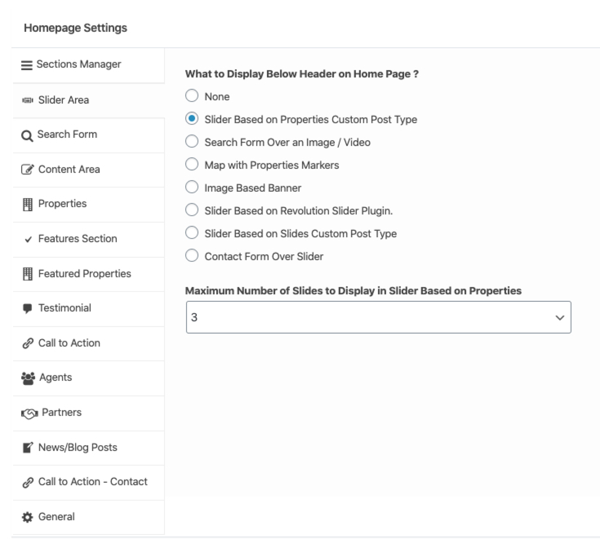
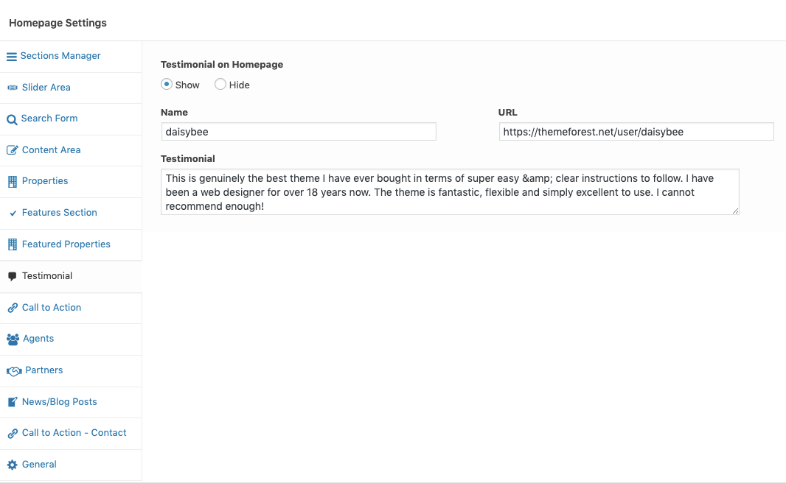
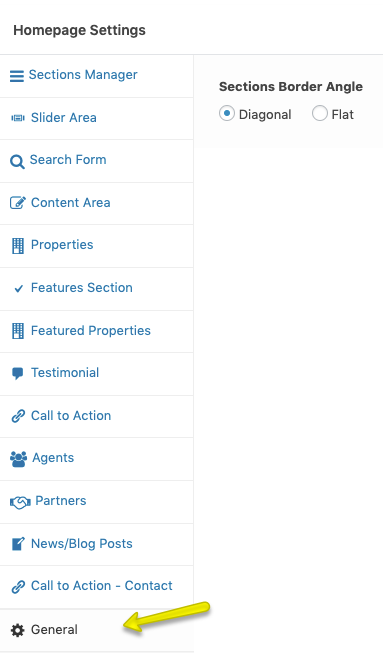

## Home Page Settings (Modern)

### **Home Page Settings**

Navigate to **Dashboard → Real Homes → Customize Settings** and look into **Home Page** panel to explore further sections.

### **Home Page Slider**
You can feed slider contents from following sources

1. **Properties Custom Post Type** - It will attach properties to your slides ( Very easy to use )
2. **Revolution Slider** - You can add text,images, buttons and videos the way you want. ( Little difficult to use but awesome results )
3. **Slides Custom Post Type** - You can attach a simple image to your slide with related text data ( easy to use with results similar to properties based slider )

Navigate to **Appearance → Customize** and look into **Home Page → Slider Area** section to configure slider settings.

#### 1. Properties Based Slider ####

Visit the slider settings as guided above and choose **Slider Based on Properties Custom Post Type** as displayed in screenshot above.

If you want to include a property in homepage slider, Then you need to edit that property and look for metabox field with tab title **"Homepage Slider"**. Open the tab and select **Yes** plus provide slide image as required by **Slider Image** field in screen shot below it.

#### 2. Revolution Sloder ####

Look for the folder name **Plugins/Revolution** Slider in unzipped package downloaded from themeforest.net. This folder will contain revolution slider's plugin zip, documentation and demo slider import zip. You need to go to **Plugins → Add New** in your WordPress dashboard side and upload the **revslider.zip** as displayed in image below.

After installing and activating Revolution Slider please navigate to **Dashboard → Slider Revolution** and click on **Import Slider** as shown in this screenshot below. The zip file of the slider is located in the main package of Real Homes Theme (**rh-main-package → Plugins → Revolution Slider → realhomes-slider-zip → realhomes.zip**).

Once the slider is imported then set it in the **Customizer Settings** (**Dashboard → Real Homes → Customize Settings → Home Page → Slider Area → What to Display Below Header on Home Page ?** and set this option as **Slider Based on Revolution Slider Plugin** and set **Revolution Slider Alias** as **realhomes**.

#### 3. "Slides" Custom Post Type Based Slider ####

To display slider based on slides custom post type, You need to add new slides as displayed in screenshot below.

After adding slides navigate to **Appearance → Customize** and Go to section **Home Page → Slider Area** and choose **Slider Based on Slides Custom Post Type** As displayed in screenshot below.

### **Display Google Maps**

Adding google map on homepage is super simple as properties already have their locations stored in database. So, Navigate to **Dashboard → Real Homes → Customize Settings** and Go to section **Home Page → Slider Area** and choose related option as shown in below screenshot.

!!! note
    To enable **Google Maps** for your website, You need to configure **Google Maps API key** under **Dashboard → Real Homes → Customize Settings → Misc** panel.

### **Properties on Home Page**

Navigate to **Dashboard → Real Homes → Customize Settings** and look for **Home Page → Home Properties** section for related settings.

### **Filter Properties**

To display properties related to on or more particular locations, statuses or types you can use related settings displayed in screen shot below.

### **Properties Sorting, Number of Properties and Section Styles**

### **Featured Propertiese**

Navigate to **Dashboard → Real Homes → Customize Settings** and look for **Home Page → Featured Properties** section for related settings.

### **Testimonial**

Navigate to **Dashboard → Real Homes → Customize Settings** and look for **Home Page → Testimonial** for related settings.

### **Agents Section**

Navigate to **Dashboard → Real Homes → Customize Settings** and look for **Home Page → Agents Section** for related settings.

### **Features Section**

Navigate to **Dashboard → Real Homes → Customize Settings** and look for **Home Page → Features Section** for related settings.

### **How to add Features**

To add features navigate to **Dashboard → Pages** and edit the page which is assigned as homepage of your website. 

On the page edit screen you will have the option to add/remove/change the information of the Features.

### **General**

In this section, you can find one of the most important settings of the homepage and that is **Sections Border Angle** which gives you the control over diagonal lines. 

You can choose from two variations **Diagonal** or **Flat**.

