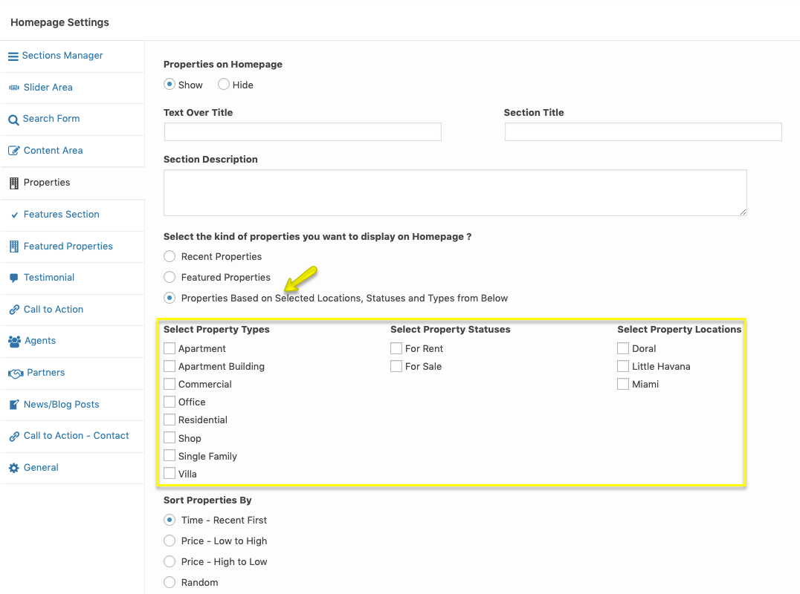
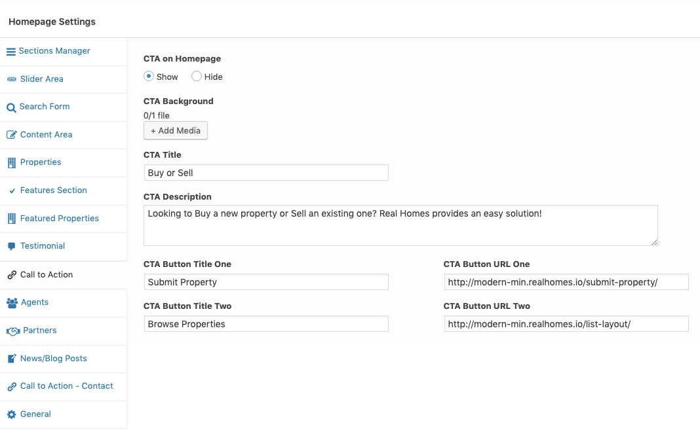
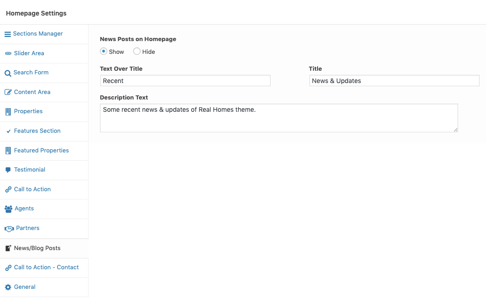

## Homepage Settings (Modern)

You can configure **Homepage Settings** from its add/edit page. Go to **Dashboard → Pages** and edit the page assigned as **Home or FrontPage**. Scroll down to find the **Homepage Settings** section.

### **Sections Manager**

**Homepage Sections Manager** gives you control over the sections order of Homepage, for example, you can display the blog posts section as first instead of featured properties section or you can put Features section at the top or in the middle.

To change the order of the sections you can drag and drop them in the **Sections Manager** tab.

### **Homepage Slider Area**

Go to **Dashboard → Pages** and edit the page assigned as **Home or FrontPage**. Scroll down to find the **Homepage Settings** section.

You can feed slider contents from following sources

1. **Properties Custom Post Type** - It will attach properties to your slides with a description box ( Default Slider, Very easy to use )
2. **Search Form Over Image / Video** - It is also possible to have search form with an image or video as a background
3. **Map with Properties Markers** - Selecting this option will display a map at the home page instead of the slider
4. **Image Based Banner** - It will be an image based banner just like the banner in sub-pages
5. **Revolution Slider** - You can add text,images, buttons and videos the way you want. ( Little difficult to use but awesome results )
6. **Slides Custom Post Type** - You can attach a simple image to your slide with related text data ( easy to use with results similar to properties based slider )
7. **Contact Form Over Slider** - Select this option to have a Contact Form Over the Slider.

Go to **Homepage Settings → Slider Area** tab to configure slider settings.

#### 1. **Properties Based Slider** ####

Visit the slider settings as guided above and choose **Slider Based on Properties Custom Post Type** as displayed in screenshot above.

If you want to include a property in homepage slider, Then you need to edit that property and look for metabox field with tab title **"Homepage Slider"**. Open the tab and select **Yes** plus provide slide image as required by **Slider Image** field in screen shot below it.

#### 2. **Search Form Over Image / Video on Homepage**

Go to **Dashboard → Pages** and edit the page assigned as **Home or FrontPage**. Scroll down to find the **Homepage Settings** section and click on **Slider Area** and choose related option as displayed in screenshot below.

For Search Form settings go to **Dashboard → Real Homes → Customize Settings → Properties Search**.

#### 3. **Display Google Maps on Homepage**

Adding google map on homepage is super simple as properties already have their locations stored in database.

So, Go to **Dashboard → Pages** and edit the page assigned as **Home or FrontPage**. Scroll down to find the **Homepage Settings** section and click on **Slider Area** tab and choose related option as shown in below screenshot.

!!! note
    To enable Google Maps for your website, You need to configure **Google Maps API key** by navigating to **Easy Real Estate → Settings → Maps**.

#### 4. **Display Image Banner on Homepage**

You can also display a simple image based banner on home page with the image of your choice.

So, Go to **Dashboard → Pages** and edit the page assigned as **Home or FrontPage**. Scroll down to find the **Homepage Settings** section and click on **Slider Area** and choose **Image Based Banner** option as displayed in below screenshot.

#### 5. **Revolution Slider** ####

Look for the folder name **Plugins/Revolution** Slider in unzipped package downloaded from themeforest.net. This folder will contain revolution slider's plugin zip, documentation and demo slider import zip. You need to go to **Plugins → Add New** in your WordPress dashboard side and upload the **revslider.zip** as displayed in image below.

After installing and activating Revolution Slider please navigate to **Dashboard → Slider Revolution** and click on **Import Slider** as shown in this screenshot below. The zip file of the slider is located in the main package of RealHomes Theme (**rh-main-package → Plugins → Revolution Slider → realhomes-slider-zip → realhomes.zip**).

Once the slider is imported then set it by navigating to **Dashboard → Pages** and edit the page assigned as **Home or FrontPage**.

Scroll down to find the **Homepage Settings** section and click on  **Slider Area** tab and choose the option called **Slider Based on Revolution Slider Plugin** and set **Revolution Slider Alias** as **realhomes**.

#### 6. **"Slides" Custom Post Type Based Slider** ####

To display slider based on slides custom post type, You need to add new slides as displayed in screenshot below.

After adding slides, go to **Dashboard → Pages** and edit the page assigned as **Home or FrontPage**. Scroll down to find the **Homepage Settings** section and click on **Slider Area** and choose **Slider Based on Slides Custom Post Type** as displayed in screenshot below.

#### 7. **Display a Contact Form Over Slider**

You can also have a Contact Form over the Slider on the home page.

So, Go to **Dashboard → Pages** and edit the page assigned as **Home or FrontPage**. Scroll down to find the **Homepage Settings** section and click on **Slider Area** and choose **Contact Form Over Slider** option as displayed below.

### **Search Form on Homepage**
Go to **Dashboard → Pages** and edit the page assigned as **Home or FrontPage**. Scroll down to find the **Homepage Settings** section and click on **Search Form** tab for the related settings.

### **Content Area on Homepage**

Go to **Dashboard → Pages** and edit the page assigned as **Home or FrontPage**. Scroll down to find the **Homepage Settings** section and click on **Content Area** tab for the related settings.

### **Properties on Homepage**

Go to **Dashboard → Pages** and edit the page assigned as **Home or FrontPage**. Scroll down to find the **Homepage Settings** section and click on **Properties** tab to configure homepage **Properties** settings.

### **Filter Properties**

To display properties based on locations, statuses or types particularly you can use related settings displayed in screenshot below.

### **Features on Homepage**

Go to **Dashboard → Pages** and edit the page assigned as **Home or FrontPage**. Scroll down to find the **Homepage Settings** section and click on **Features Section** for related settings. Add Feature Image, Feature Title, Feature Description and Feature URL for three columns by using the **+ Add more** button to display Features Section on Homepage.

### **Featured Properties on Homepage**

Go to **Dashboard → Pages** and edit the page assigned as **Home or FrontPage**. Scroll down to find the **Homepage Settings** section and click on **Featured Properties** tab for related settings.

### **Testimonial on Homepage**

Go to **Dashboard → Pages** and edit the page assigned as **Home or FrontPage**. Scroll down to find the **Homepage Settings** section and click on **Testimonial** tab for related settings.

### **Call to Action on Homepage**

Go to **Dashboard → Pages** and edit the page assigned as **Home or FrontPage**. Scroll down to find the **Homepage Settings** section and click on **Call to Action** tab for related settings.

### **Agents on Homepage**

Go to **Dashboard → Pages** and edit the page assigned as **Home or FrontPage**. Scroll down to find the **Homepage Settings** section and click on **Agents** tab for related settings.

### **Partners on Homepage**

Go to **Dashboard → Pages** and edit the page assigned as **Home or FrontPage**. Scroll down to find the **Homepage Settings** section and click on **Partners** tab for related settings.

### **News Posts on Homepage**

Go to **Dashboard → Pages** and edit the page assigned as **Home or FrontPage**. Scroll down to find the **Homepage Settings** section and click on **News/Blog Posts** tab for related settings.

### **Call to Action - Contact on Homepage**
Go to **Dashboard → Pages** and edit the page assigned as **Home or FrontPage**. Scroll down to find the **Homepage Settings** section and click on **Call to Action - Contact** tab for related settings.

### **General**

In this section, you can find one of the most important settings of the homepage and that is **Sections Border Angle** which gives you the control over diagonal lines. 

You can choose from two variations **Diagonal** or **Flat**.

