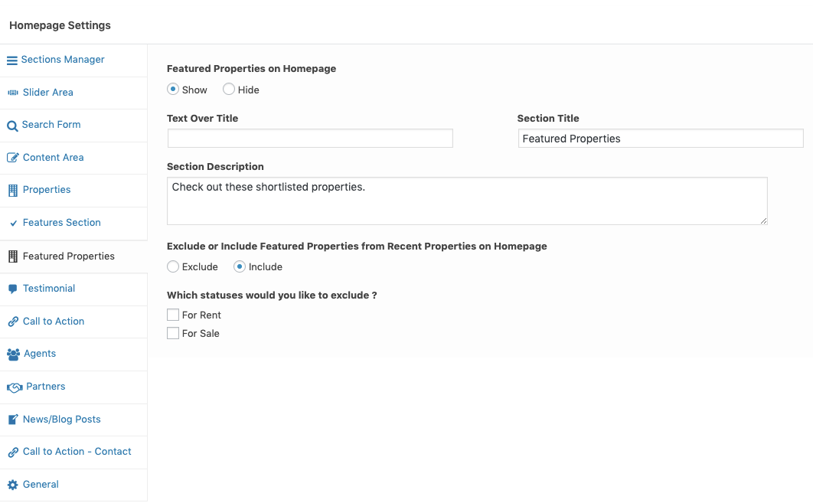
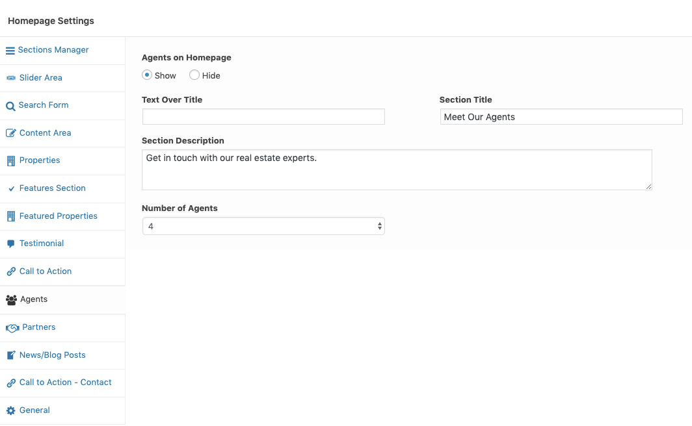

## Home Page Settings (Modern)

### **Home Page Settings**

Navigate to **Dashboard → Real Homes → Customize Settings** and look into **Home Page** panel to explore further sections.

### **Display Google Maps**

Adding google map on homepage is super simple as properties already have their locations stored in database. So, Navigate to **Dashboard → Real Homes → Customize Settings** and Go to section **Home Page → Slider Area** and choose related option as shown in below screenshot.

!!! note
    To enable **Google Maps** for your website, You need to configure **Google Maps API key** under **Dashboard → Real Homes → Customize Settings → Misc** panel.

### **Properties on Home Page**

Navigate to **Dashboard → Real Homes → Customize Settings** and look for **Home Page → Home Properties** section for related settings.

### **Filter Properties**

To display properties related to on or more particular locations, statuses or types you can use related settings displayed in screen shot below.

### **Properties Sorting, Number of Properties and Section Styles**

### **Featured Propertiese**

Navigate to **Dashboard → Real Homes → Customize Settings** and look for **Home Page → Featured Properties** section for related settings.

### **Testimonial**

Navigate to **Dashboard → Real Homes → Customize Settings** and look for **Home Page → Testimonial** for related settings.

### **Agents Section**

Navigate to **Dashboard → Real Homes → Customize Settings** and look for **Home Page → Agents Section** for related settings.

### **Features Section**

Navigate to **Dashboard → Real Homes → Customize Settings** and look for **Home Page → Features Section** for related settings.

