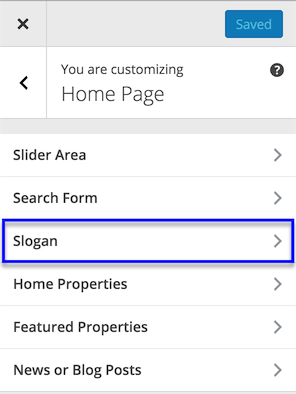
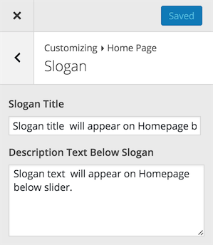

# Slogan on Home Page

Navigate to **Dashboard → Appearance → Customize** and look for **Home Page** section. It contains **Slogan** section where you can change slogan text and description text.

#### Slogan Panel

#### Slogan Settings

