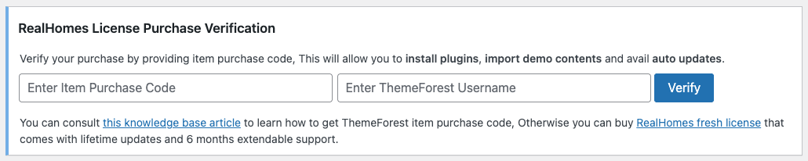
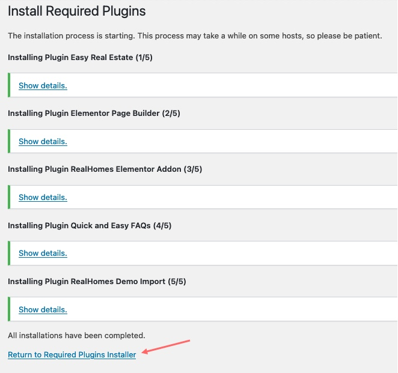
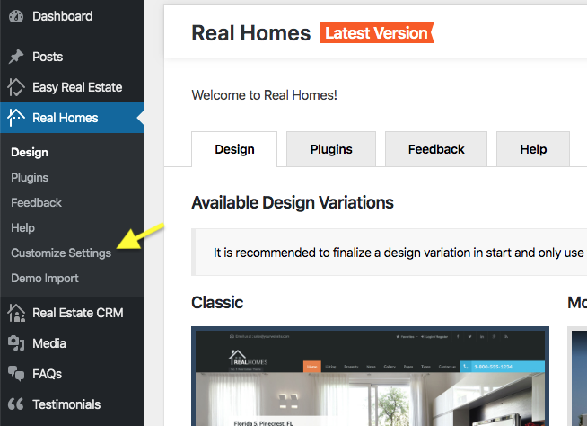
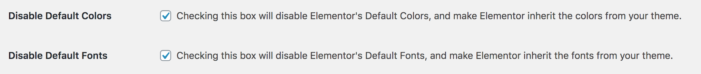

!!! info "About Hotel Demo"

    A new **Hotel Demo** is introduced with multiple RealHomes Elementor Widgets in version {== **4.3.0** ==}.

## Theme Installation

Assuming you have the full package (**rh-main-package.zip**) of RealHomes theme. Extract it and you will have **rh-main-package** folder. Open it and follow the instructions below.

### **Upload Theme's Zip & Activate**

Go to **Appearance → Themes** section and click **Add New**


Click **Upload Theme**


Choose the **realhomes.zip** file and press **Install Now**


Once the theme is uploaded then you need to activate it.

### **Activate Your License**

- Also, a notice will be displayed at the top of welcome page asking you to **Enter Item Purchase Code** and then click on the **Verify** button. RealHomes purchase verification allows you to **install plugins, import demo contents** and avail **auto updates**. For help to retrieve RealHomes purchase code you can follow our knowledge base article on [How to Get Themeforest Item Purchase Code](https://support.inspirythemes.com/knowledgebase/how-to-get-themeforest-item-purchase-code/) 


### **Update Permalinks Settings**

Go to **Dashboard → Settings → Permalinks** and choose **Post name** from **Common Settings** and save the changes, As displayed in screenshot below.


### **Required Plugin Installation & Activation**

- After **RealHomes Purchase Verification**, a notice will be displayed at the top asking you to install and activate the required plugins. So, go ahead and click on **Begin installing plugins**.<br>

- On next page you will see the list of plugins to install. Select all the plugins and click on **Install** and then click on **Apply** to install all of them at once (as shown in the screenshot below). </br>

- After all the plugins are installed click on **Return** to **Required Plugins Installer**. <br>

- Once again select all the plugins and click on **Activate** and then click on **Apply** to activate all the plugins and you are done. <br>

- After activation go to "**RealHomes → Customize Settings**" to play with theme's settings. You can also import the demo data before changing any settings in the Customizer.<br>


if you face any problem during upload through dashboard, please upload the theme using FTP as guided below.

## **Import Hotel Demo**

### **Step 1**

First, please go to **Dashboard → Easy Real Estate → New Field Builder** and paste the following code in **Backup JSON** field and click on "**Save Settings**" to save and import the required fields for Hotel Demo.

```
{"ere_field_icon_type":"image-icon","ere_allow_svg_upload":"true","inspiry_additional_fields_list":[{"field_name":"Design By","field_type":"text","field_image_icon":["5686"],"field_display":["listing","single"]},{"field_name":"Internet","field_type":"text","field_image_icon":["6156"],"field_display":["listing","single"]},{"field_name":"Self check-in","field_type":"text","field_image_icon":["6791"],"field_display":["listing","single"]},{"field_name":"Smart TV","field_type":"text","field_image_icon":["6158"],"field_display":["listing","single"]},{"field_name":"Breakfast","field_type":"text","field_image_icon":["6157"]},{"field_name":"Cancelation Policy","field_type":"text","field_image_icon":["5687"],"field_display":["listing","single"]},{"field_name":"Cleaning","field_type":"text","field_image_icon":["6183"],"field_display":["listing","single"]},{"field_name":"Mountain View","field_type":"text","field_image_icon":["6442"],"field_display":["listing","single"]}]}
```

### **Step 2**

Navigate to **Dashboard → RealHomes → Import Demo**, click on **Ultra** label to see all the available demos based on Ultra design. After that click on the **Import Demo** button of **Hotel - Elementor** demo. You will see the **Import Demo** button after hovering over the **Hotel - Elementor** demo card.


## **Initial Elementor Settings**

- Navigate to **Dashboard → Elementor → Settings** and make sure **Disable Default Colors** and **Disable Default Fonts** are enabled.

- In this same section, click on **Styles** and check the **Content Width** is set to **1240**.


## **Common Installation Issues**

All of the following issues/errors are either user-created or server-side problems.

!!! error "**Theme is missing the style.css stylesheet error**"
    This issue occurs if you upload rh-main-package.zip file, check out this guide: https://help.market.envato.com/hc/en-us/articles/202821510-Theme-is-missing-the-style-css-stylesheet-error

!!! error "**The link you followed has expired**"
    This error happens if your hosting server is not configured with proper PHP parameters, you can find the solution in this guide: https://support.inspirythemes.com/knowledgebase/how-to-fix-the-link-you-followed-has-expired-in-wordpress/

!!! error "**Broken / Missing CSS Styles**"
    This problem only occurs if the theme directory doesn't have appropriate permissions, learn how you can fix it in this article: https://support.inspirythemes.com/knowledgebase/how-to-fix-broken-styles-after-installing-or-updating-the-theme/

!!! error "**Missing temporary directory**"
    You might also face this problem on some rare hosting servers if WordPress is not properly installed, so we have a solution in this quick guide: https://support.inspirythemes.com/knowledgebase/destination-directory-for-file-streaming-does-not-exist-or-is-not-writable/

If you face any other problem that is not listed above then [create a ticket](https://support.inspirythemes.com/ask-question/) at our support platform by [signing up](https://support.inspirythemes.com/login-register/) and we will assist you as soon as possible.