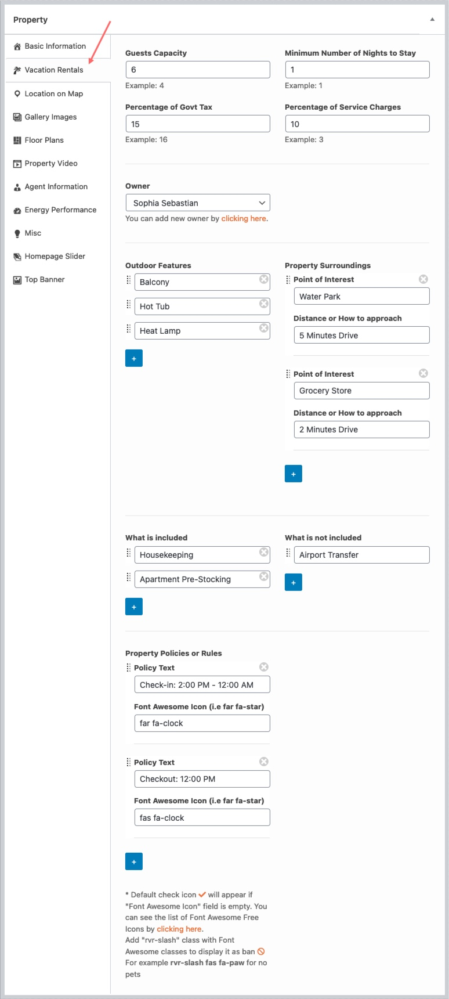

RealHomes Vacation Rentals booking system provides a complete rental solution from booking to reserved dates calendar and dedicated rental specific advance search with many more features.

!!! info "Important Information"

    Vacation Rentals booking system is introduced in RealHomes version {== **3.12.0** ==}. Before you start setting it up, ensure RealHomes theme `version 3.12.0` and all latest required plugins are installed and activated. To set it up please follow the guide given below.

### **Installation**
You would need to install **RealHomes Vacation Rentals** plugin. Go to the **Dashboard > RealHomes > Plugins** and click on the *Install Now* button of the *RealHomes Vacation Rentals* plugin card.

After plugin installation click on the *Activate* button.

Once you activate the above plugin you are able to import the **Vacation Rentals Demo Contents** now. Go to **Real Homes → Demo Import** to import demo data.

Before you begin, make sure all the required plugins are installed and activated.

Click on blue **Import** button and you will see a popup so click on the blue **Yes, import!** button again to confirm the import for the relevant layout of the theme. Wait for few minutes as the demo images are being fetched from the remote server and this process can take a couple of minutes.

!!! warning "Important"
    Sometimes, the import process takes longer than expected and doesn't complete in the first attempt. So, simply import again until the process is complete.

### **Step 3**

Once the import process is complete, You will receive a notice as the one displayed in the screen shot below.

Visit your site and you will find your site working like the theme demo. In case of any problem, Get in touch with our support team using our support site.

### **Settings**
To configure Vacation Rentals settings go to **Dashbaord > Vacation Rentals > Settings** page.

You can configure the following settings on this page.

- *Enable/Disable Vacation Rentals* - You can `Enable/Disable` the whole vacation rentals functionality.
- *Contact Information* - Set the booking `Phone Number*`, `Contact Page` for additional queries and `Booking Email*`.
- *Booking Notification for Owner* - By default booking notification emails go to the given booking email only. You can also enable the `Booking Notifications for the Property Owner`.
- *Terms and Conditions* - You can show/hide the `Terms & Conditions Option` and also set this option `Description`.
- *Property Sections Labels* - There are different property detail page sections related to the vacation rentals. Those sections labels can be set on this settings page.

Once you activate the vacation rentals, you will have following rentals features.
### **Vacation Rentals information of Property**
You can see a new **Vacation Rentals** section on the property add/edit page where all rental information can be added for a property.

